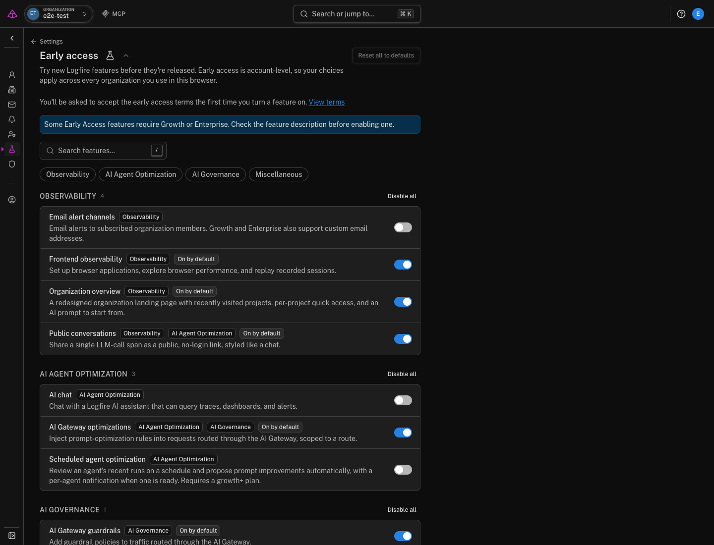
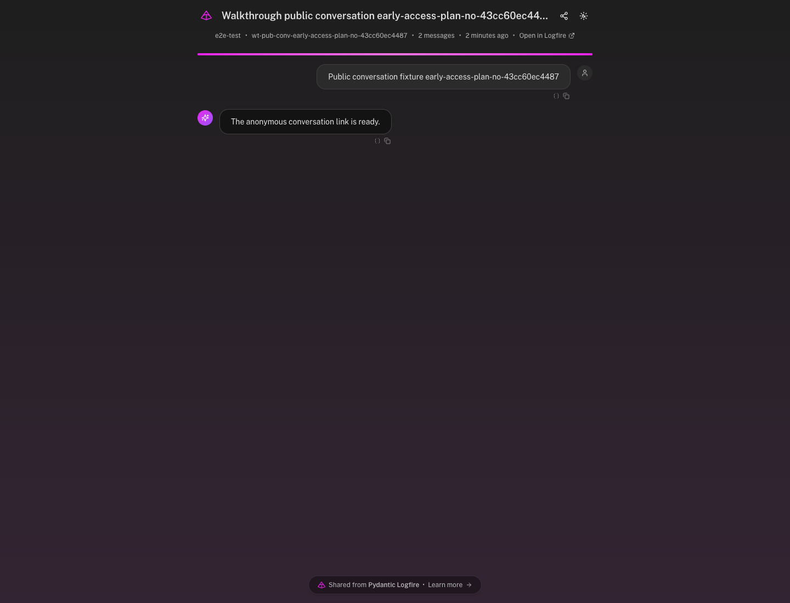

# Share an AI conversation with a public link

Send someone a focused view of one LLM interaction without giving them access to your Logfire project or the rest of the trace.

!!! note "Early Access availability"

    Some Early Access features require Growth or Enterprise. Public Conversations is an Early Access feature. Enable it in **Settings → Early access** in the browser where you use Logfire. Early Access choices are stored in that browser and apply across the organizations you use there.

A public conversation starts from one LLM span (one model call, with a start and a duration). The default **Bubbles only** view presents its user, assistant, and tool messages as a chat. The public page also shows the share title and the Logfire organization and project names. Its data response keeps the span identifiers and timing needed to render the page, but excludes system and developer instructions, tool definitions, span events, raw provider attributes, and service, process, resource, and HTTP metadata.

Use a public conversation when someone needs the model exchange itself, for example in a support ticket or a review. Use a [public trace](../../../guides/web-ui/public-traces.md) when they need the full journey of one request, made of nested spans.

## Enable Public Conversations

1. Open **Settings → Early access**.
2. Find **Public conversations** under **Observability** or **AI Agent Optimization**.
3. Turn on the switch. The first Early Access feature you enable asks you to accept the Early Access terms.

The switch only controls where the sharing controls appear in your browser. Project permissions still decide whether you can create, rename, or revoke a public link.

## Share one conversation

1. Open **Live view** and select an LLM span, or open an agent run.
2. Select **Share conversation** in the details header.
3. Review the title and choose when the link expires. The default is one week.
4. Select **Share** to copy or send the link, or **Share & open** to inspect the public page first.

Anyone with the link can open it without signing in. Treat the link as a credential and send it only to people who should see the conversation.

!!! warning "Advanced views expose the full span"

    **Bubbles only** is the safer default because it does not return raw span attributes. If you open **Advanced** and select **Bubbles · Transcript · Span**, the Transcript and Span tabs expose all attributes recorded on that span. Those attributes can include prompts, model inputs and outputs, tool data, user data, and application metadata. Review the share title and the span before creating the link.

The link stops working at the expiration you choose, when you revoke it, or when the underlying span ages out of your plan's data retention period. Choosing **Never** removes the link expiration, but it does not extend data retention.

## Verify the public view

Open the copied link in a private browser window where you are not signed in to Logfire. You should see the title and conversation messages. A **Bubbles only** share should not show Transcript or Span tabs.

If you enabled all views, inspect each tab before sending the link. Confirm that every visible attribute is appropriate to share outside the project.

## Manage and revoke links

Open **Project settings → Public traces** to see public trace and conversation links for the project. From there you can copy a link, change its title, or delete it. Deleting a public link revokes access immediately and cannot be undone.

Deleting a link does not delete the original span or conversation from your project.

## Troubleshooting

| Symptom | Cause and fix |
| --- | --- |
| **Share conversation** is missing | Enable **Public conversations** in **Settings → Early access** in this browser. |
| The control says the conversation is not shared publicly | Your project role does not have permission to create public conversation links. Ask a project administrator to share it or update your role. |
| The public link returns **Not found** | The link expired, someone revoked it, or the underlying span aged out of data retention. Create a new link if the span is still available. |
| Messages are missing | Logfire could not reconstruct those messages from the attributes recorded by your LLM instrumentation. Open the original span and check which message attributes it contains. |

Next, review [scrubbing sensitive data](../../../how-to-guides/scrubbing.md) to control what your application sends to Logfire before you create public links.
