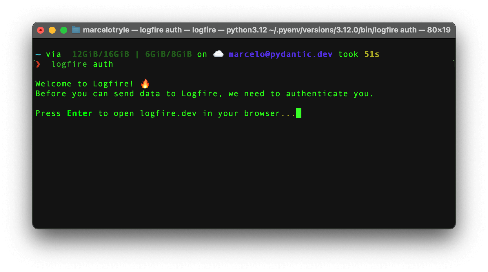
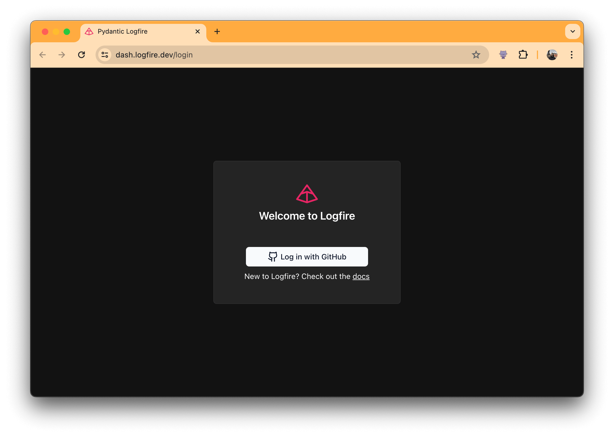
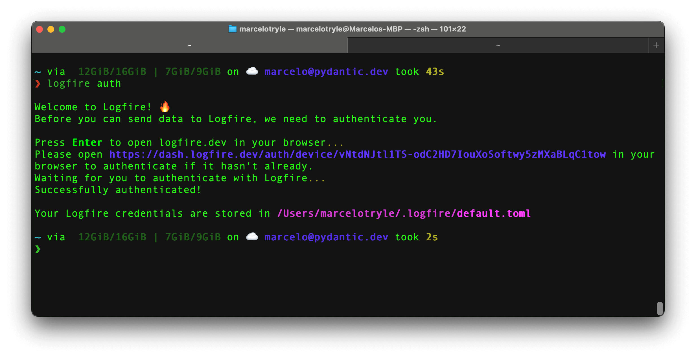
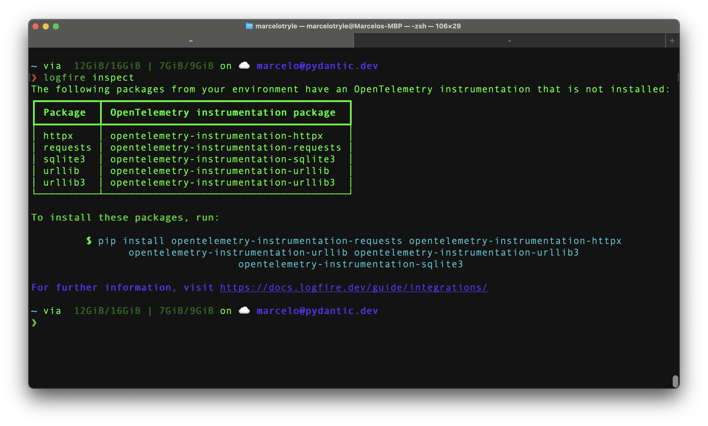

# SDK Command Line Interface

**Logfire** comes with a CLI used for authentication and project management:

```
{{ logfire_help }}
```

## Authentication (`auth`)

You need to be authenticated to use the **Logfire**.

!!! abstract
    Read the [Terms of Service][terms-of-service] and [Privacy Policy][privacy_policy] if you want
    to know how we handle your data. :nerd_face:

To authenticate yourself, run the `auth` command in the terminal:

```bash
logfire auth
```

You will be prompted to select a [data region](./data-regions.md) (EU or US). To specify this
via the cli instead of interactively, use `logfire --region eu auth` or `logfire --region eu auth`

Then you will be given the option to open logfire in your browser:



After pressing `"Enter"`, you will be redirected to the browser to log in to your account.



Then, if you go back to the terminal, you'll see that you are authenticated! :tada:



## Clean (`clean`)

To clean _most_ the files created by **Logfire**, run the following command:

```bash
logfire clean
```

The clean command doesn't remove the logs, and the authentication information stored in the `~/.logfire` directory.

To also remove the logs, you can run the following command:

```bash
logfire clean --logs
```

## Inspect (`inspect`)

The inspect command is used to identify the missing OpenTelemetry instrumentation packages in your project.

To inspect your project, run the following command:

```bash
logfire inspect
```

This will output the projects you need to install to have optimal OpenTelemetry instrumentation.



## Who Am I (`whoami`)

!!! warning "🚧 Work in Progress 🚧"
    This section is yet to be written, [contact us](../help.md) if you have any questions.

## Projects

<!-- TODO(Marcelo): We can add the `logfire projects --help` here. -->

### List (`projects list`)

To check the projects you have access to, run the following command:

```bash
logfire projects list
```

You'll see something like this:

```bash
❯ logfire projects list
┏━━━━━━━━━━━━━━┳━━━━━━━━━━━━━━━━┓
┃ Organization ┃ Project        ┃
┡━━━━━━━━━━━━━━╇━━━━━━━━━━━━━━━━┩
│ Kludex       │ backend        │
│ Kludex       │ worker         │
└──────────────┴────────────────┘
```

### Use (`projects use`)

To use an already created project, run the following command:

```bash
logfire projects use <project-name>
```

For example, to use the `backend` project, you can run:

```bash
logfire projects use backend
```

### Create (`projects new`)

To create a new project, run the following command:

```bash
logfire projects new <project-name>
```

Follow the instructions, and you'll have a new project created in no time! :partying_face:

[terms-of-service]: https://pydantic.dev/legal/terms-of-service
[privacy_policy]: https://pydantic.dev/legal/privacy-policy
