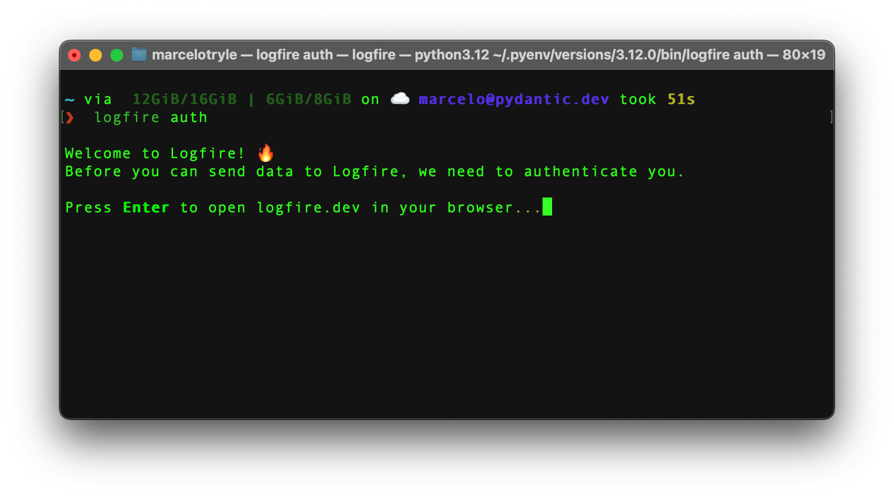
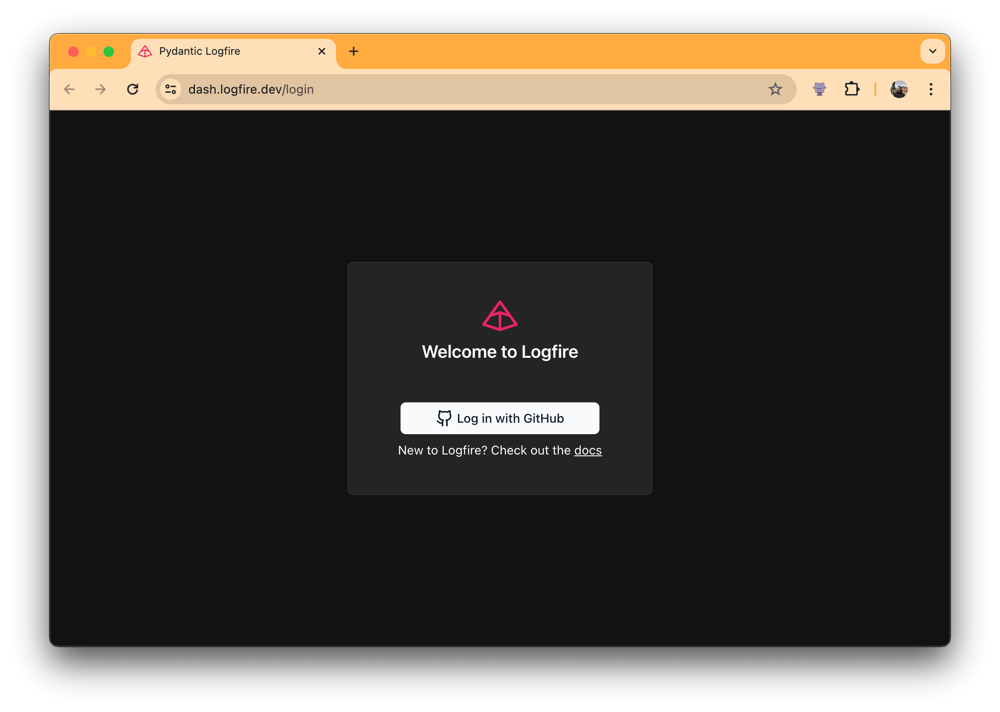
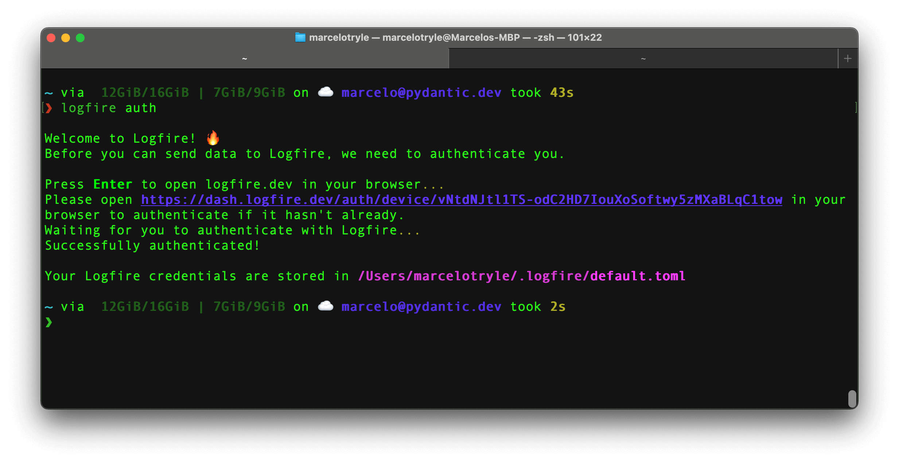
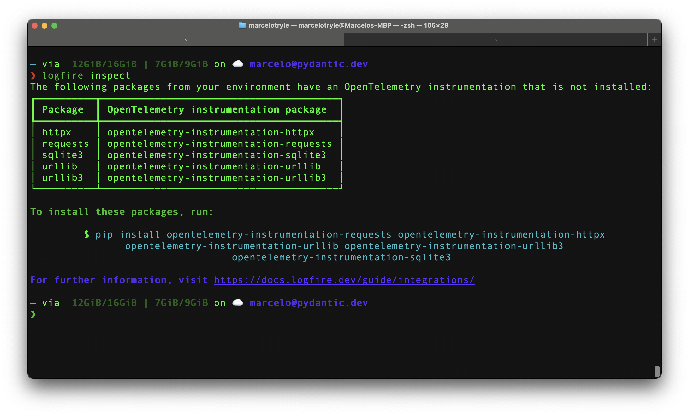

# SDK Command Line Interface

**Logfire** comes with a CLI used for authentication and project management:

```
{{ logfire_help }}
```

## Authentication (`auth`)

You need to be authenticated to use the **Logfire**.

!!! abstract
    Read the [Terms of Service][terms-of-service] and [Privacy Policy][privacy_policy] if you want
    to know how we handle your data. :nerd_face:

To authenticate yourself, run the `auth` command in the terminal:

```bash
logfire auth
```

You will be prompted to select a [data region](./data-regions.md) (EU or US). To specify this
via the cli instead of interactively, use `logfire --region eu auth` or `logfire --region us auth`

!!! note
    If you're using a [self-hosted Logfire instance](./self-hosted/overview.md), you can authenticate by specifying your instance's URL using the `--base-url` flag:
    `logfire --base-url="https://<your_logfire_hostname>" auth`

Then you will be given the option to open logfire in your browser:



After pressing `"Enter"`, you will be redirected to the browser to log in to your account.



Then, if you go back to the terminal, you'll see that you are authenticated! :tada:



### OAuth 2.1 device flow (`auth --oauth`)

By default `logfire auth` issues a long-lived bearer token that is stored in
plaintext in `~/.logfire/default.toml`. If your Logfire instance supports the
OAuth 2.1 device authorization grant ([RFC 8628][rfc8628]), you can opt into a
modern flow that uses a short-lived access token plus a refresh token, with
secrets held in the operating system keyring whenever possible.

```bash
logfire auth --oauth
```

Install the `cli` extra to enable keyring-backed storage (macOS Keychain,
Linux Secret Service, Windows Credential Locker):

```bash
pip install 'logfire[cli]'
```

!!! note
    The legacy long-lived-token flow remains the default. Both kinds of records
    can coexist in `~/.logfire/default.toml` for different base URLs.

#### What happens behind the scenes

1. `/.well-known/oauth-authorization-server` is fetched to discover endpoints
   ([RFC 8414][rfc8414]).
2. The CLI attempts the device flow using the preregistered `logfire-cli`
   client.  If the server rejects it with `invalid_client` **and** advertises a
   `registration_endpoint`, the CLI falls back to Dynamic Client Registration
   ([RFC 7591][rfc7591]) and caches the resulting client id.
3. The CLI generates PKCE parameters ([RFC 7636][rfc7636]), requests a device
   code, opens the browser to the verification URL and polls until you finish
   authenticating.
4. The issued `access_token`/`refresh_token` pair is stored in the OS keyring
   (service name `logfire-oauth`); only non-secret metadata (scope, expiration,
   and for DCR clients `client_id` + `registration_client_uri`) lands in
   `~/.logfire/default.toml`.  When the keyring is unavailable, tokens are
   written inline to the same file, which is `chmod 0600`.
5. Access tokens are refreshed transparently as they approach expiry. Refresh
   requests are serialized across concurrent processes via an advisory file
   lock on `~/.logfire/default.toml.lock` so that a refresh token is never
   spent twice in parallel.

#### Storage layout

```toml
# Legacy long-lived token — recognized by the `token` field
[tokens."https://logfire-us.pydantic.dev"]
token = "pylf_v1_us_..."
expiration = "2099-12-31T23:59:59"

# OAuth with the preconfigured `logfire-cli` client and keyring storage
[tokens."https://logfire-eu.pydantic.dev"]
scope = "project:read_dashboard"
expiration = "2026-04-17T12:00:00+00:00"
keyring_service = "logfire-oauth"

# OAuth via Dynamic Client Registration (tokens inline — no keyring)
[tokens."http://localhost:3000"]
scope = "project:read_dashboard"
expiration = "2026-04-17T12:00:00+00:00"
client_id = "dcr-issued-abc"
registration_client_uri = "http://localhost:3000/oauth2/register/dcr-issued-abc"
oauth_token = "..."
refresh_token = "..."
```

Tokens `token` / `oauth_token` / `refresh_token` wrap the underlying string in
a `SecretStr` at runtime: their default `str()` / `repr()` produce
`'**********'` so accidental logging cannot leak credentials.

#### Logging out

To log out and remove the stored tokens:

```bash
logfire auth logout
```

For OAuth records, `logout` additionally:

- Deletes the associated entry from the OS keyring.
- For Dynamic Client Registration clients only, issues a best-effort
  [RFC 7592][rfc7592] `DELETE` against `registration_client_uri` to deregister
  the client on the server. The preconfigured `logfire-cli` is never
  deregistered.

[rfc8628]: https://www.rfc-editor.org/rfc/rfc8628
[rfc8414]: https://www.rfc-editor.org/rfc/rfc8414
[rfc7591]: https://www.rfc-editor.org/rfc/rfc7591
[rfc7592]: https://www.rfc-editor.org/rfc/rfc7592
[rfc7636]: https://www.rfc-editor.org/rfc/rfc7636

## Clean (`clean`)

To clean _most_ the files created by **Logfire**, run the following command:

```bash
logfire clean
```

The clean command doesn't remove the logs, and the authentication information stored in the `~/.logfire` directory.

To also remove the logs, you can run the following command:

```bash
logfire clean --logs
```

## Inspect (`inspect`)

The inspect command is used to identify the missing OpenTelemetry instrumentation packages in your project.

To inspect your project, run the following command:

```bash
logfire inspect
```

This will output the projects you need to install to have optimal OpenTelemetry instrumentation.



## Who Am I (`whoami`)

!!! warning "🚧 Work in Progress 🚧"
    This section is yet to be written, [contact us](../help.md) if you have any questions.

## Projects

<!-- TODO(Marcelo): We can add the `logfire projects --help` here. -->

### List (`projects list`)

To check the projects you have access to, run the following command:

```bash
logfire projects list
```

You'll see something like this:

```bash
❯ logfire projects list
┏━━━━━━━━━━━━━━┳━━━━━━━━━━━━━━━━┓
┃ Organization ┃ Project        ┃
┡━━━━━━━━━━━━━━╇━━━━━━━━━━━━━━━━┩
│ Kludex       │ backend        │
│ Kludex       │ worker         │
└──────────────┴────────────────┘
```

### Use (`projects use`)

To use an already created project, run the following command:

```bash
logfire projects use <project-name>
```

For example, to use the `backend` project, you can run:

```bash
logfire projects use backend
```

### Create (`projects new`)

To create a new project, run the following command:

```bash
logfire projects new <project-name>
```

Follow the instructions, and you'll have a new project created in no time! :partying_face:

[terms-of-service]: https://pydantic.dev/legal/terms-of-service
[privacy_policy]: https://pydantic.dev/legal/privacy-policy
