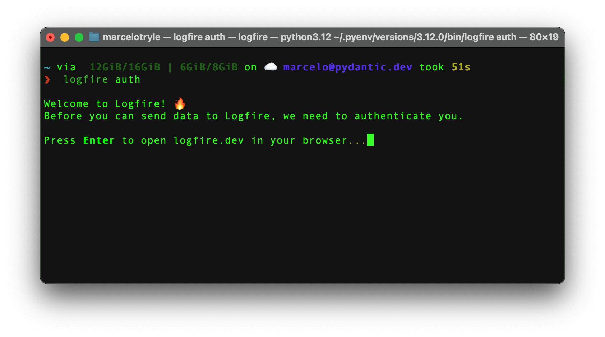
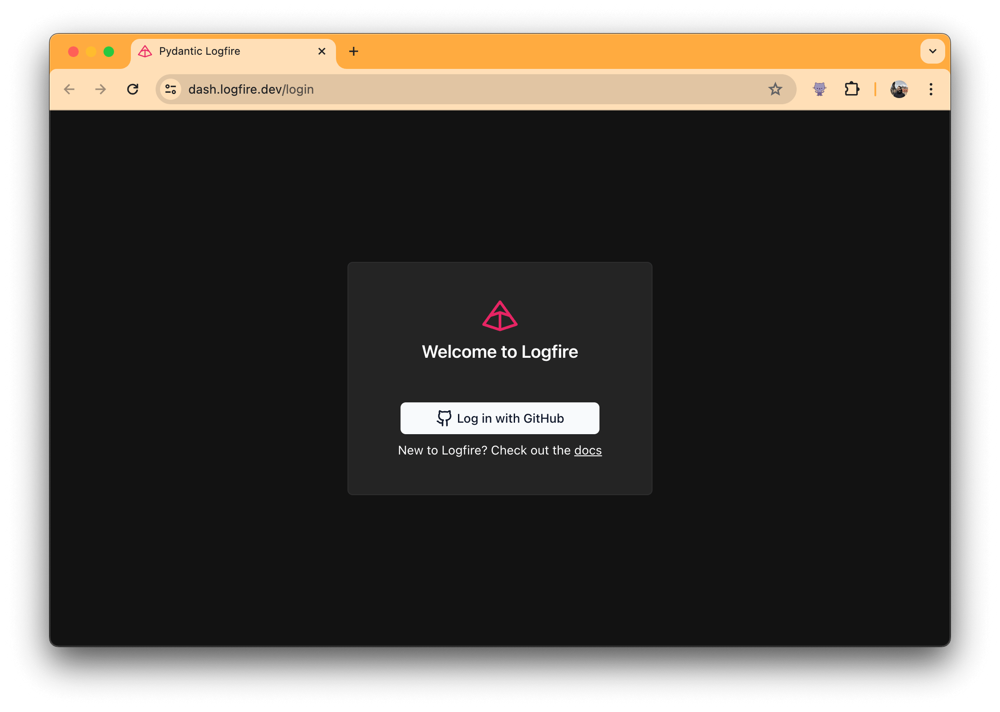
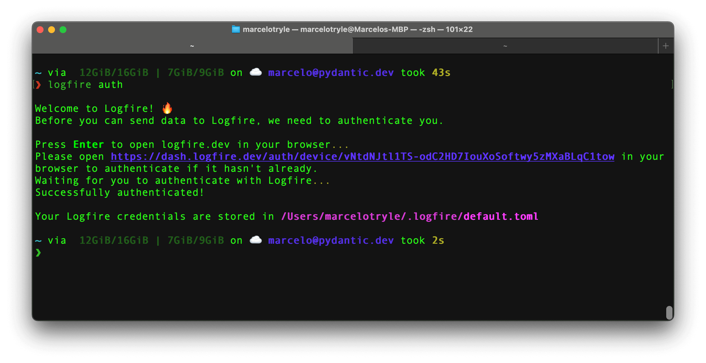

# SDK Command Line Interface

**Logfire** comes with a CLI used for authentication and project management:

```
{{ logfire_help }}
```

## Authentication (`auth`)

You need to be authenticated to use the **Logfire**.

!!! abstract
    Read the [Terms of Service][terms-of-service] and [Privacy Policy][privacy_policy] if you want
    to know how we handle your data. :nerd_face:

To authenticate yourself, run the `auth` command in the terminal:

```bash
logfire auth
```

You will be prompted to select a [data region](./data-regions.md) (EU or US). To specify this
via the cli instead of interactively, use `logfire --region eu auth` or `logfire --region us auth`

!!! note
    If you're using a [self-hosted Logfire instance](./self-hosted/overview.md), you can authenticate by specifying your instance's URL using the `--base-url` flag:
    `logfire --base-url="https://<your_logfire_hostname>" auth`

Then you will be given the option to open logfire in your browser:



After pressing `"Enter"`, you will be redirected to the browser to log in to your account.



Then, if you go back to the terminal, you'll see that you are authenticated! :tada:



### Log out (`auth logout`)

To log out and remove the locally stored credentials, run:

```bash
logfire auth logout
```

## Clean (`clean`)

To clean _most_ the files created by **Logfire**, run the following command:

```bash
logfire clean
```

The clean command doesn't remove the logs, and the authentication information stored in the `~/.logfire` directory.

To also remove the logs, you can run the following command:

```bash
logfire clean --logs
```

## AI Gateway (`gateway`)

The gateway command runs a local OAuth proxy for the Logfire AI Gateway and can launch supported AI coding tools with short-lived credentials.

Install the optional dependencies before using it:

=== "uv"

    ```bash
    uv add "logfire[gateway]"
    ```

=== "pip"

    ```bash
    pip install "logfire[gateway]"
    ```

=== "poetry"

    ```bash
    poetry add "logfire[gateway]"
    ```

Launch a supported integration through the proxy:

```bash
logfire gateway launch claude
```

!!! note
    For self-hosted Logfire, set `LOGFIRE_BASE_URL` to your Logfire URL or pass `--base-url "https://<your-logfire-host>"` before `gateway`. If the Gateway is exposed at a different URL, set `LOGFIRE_GATEWAY_URL` or append `--gateway-url "https://<your-gateway-host>"`.

You can also run only the proxy and configure a tool manually:

```bash
logfire gateway serve
```

Use `--device-flow` if browser callback authorization is not available, or pass `--region eu` / `--region us` before `gateway` to select the Logfire region.

## Inspect (`inspect`)

The inspect command is used to identify the missing OpenTelemetry instrumentation packages in your project.

To inspect your project, run the following command:

```bash
logfire inspect
```

This will output the projects you need to install to have optimal OpenTelemetry instrumentation.


## Info (`info`)

To print the versions of `logfire`, your operating system, and related (OpenTelemetry) packages (useful when reporting a bug) run:

```bash
logfire info
```

## Who Am I (`whoami`)

To show the currently authenticated user and the URL of the current **Logfire** project, run:

```bash
logfire whoami
```

If you have one or more tokens configured (e.g. via the `LOGFIRE_TOKEN` environment variable), this shows the project each token belongs to instead.

## Projects

### List (`projects list`)

To check the projects you have access to, run the following command:

```bash
logfire projects list
```

You'll see something like this:

```bash
❯ logfire projects list
┏━━━━━━━━━━━━━━┳━━━━━━━━━━━━━━━━┓
┃ Organization ┃ Project        ┃
┡━━━━━━━━━━━━━━╇━━━━━━━━━━━━━━━━┩
│ Kludex       │ backend        │
│ Kludex       │ worker         │
└──────────────┴────────────────┘
```

### Use (`projects use`)

To use an already created project, run the following command:

```bash
logfire projects use <project-name>
```

For example, to use the `backend` project, you can run:

```bash
logfire projects use backend
```

### Create (`projects new`)

To create a new project, run the following command:

```bash
logfire projects new <project-name>
```

Follow the instructions, and you'll have a new project created in no time! :partying_face:

### Status (`projects status`)

To see what telemetry has actually reached a project, run:

```bash
logfire projects status
```

```bash
Project  my-org/orders
         https://logfire-us.pydantic.dev/my-org/orders

 Service         | Records | Last seen
-----------------|---------|---------------------------------
 orders-web      | 87      | 2026-08-19T01:01:29.717170+00:00
 orders-worker   | 84      | 2026-08-19T01:01:29.716577+00:00
```

One row per service, so a partly-instrumented system shows up as one: if you instrumented a web app and a worker but only the web app appears, the worker is not reporting.

This needs a saved read token — see below — and reports the last hour. Write credentials
(`projects use`/`new`) are not required: a saved read token already records which project
it belongs to, so `read-tokens --project ORGANIZATION/PROJECT_NAME create --save` on its
own is enough. If this directory IS linked to a project, the saved token must match it.
Add `--json` for machine-readable output.

## Read tokens (`read-tokens`)

To create a [read token](../how-to-guides/query-api.md) for a project and print it to stdout, run:

```bash
logfire read-tokens --project <org>/<project> create
```

Because the token is printed to stdout, this composes well with other tools, e.g. configuring the [Logfire MCP server](../how-to-guides/mcp-server.md):

```bash
claude mcp add logfire -e LOGFIRE_READ_TOKEN=$(logfire read-tokens --project <org>/<project> create) -- uvx logfire-mcp@latest
```

### Saving a token instead of printing it

To store the token in the data directory rather than printing it, use `--save`:

```bash
logfire read-tokens create --save
```

With no `--project`, this uses the project the current directory is linked to. The token is written to `.logfire/read_token.json`, readable only by you, in the same gitignored directory that already holds your write credentials — and it is never printed, so it cannot end up in your terminal history, a CI log, or a coding agent's transcript.

`logfire projects status` uses this token. A saved token expires after 30 days; run the command again to replace it.

!!! note
    A read token can read everything in the project, which may include personal data captured in span attributes. Keep `.logfire/` out of version control — the CLI adds a `.gitignore` for you — and use `logfire clean` to remove stored credentials.

## Run (`run`)

To run a Python script or module with **Logfire** instrumentation enabled automatically for all installed packages that have an available OpenTelemetry instrumentation, run:

```bash
logfire run script.py
# or run a module, forwarding any arguments after it:
logfire run -m my_module --my-arg
```

By default a summary box is printed to stderr showing which packages were instrumented; disable it with `--no-summary`. Use `--exclude` to skip instrumenting specific packages:

```bash
logfire run --exclude sqlalchemy,fastapi script.py
```

## Prompt (`prompt`)

To generate a prompt for an LLM to investigate an issue in your project (assuming the [Logfire MCP server](../how-to-guides/mcp-server.md) is configured), run:

```bash
logfire prompt "why are my requests slow?"
```

Use `--claude`, `--codex`, or `--opencode` to verify (and set up) the MCP configuration for the respective coding tool, `--update` to replace an existing Logfire MCP server configuration, and `--project <org>/<project>` to select the project.

[terms-of-service]: https://pydantic.dev/legal/terms-of-service
[privacy_policy]: https://pydantic.dev/legal/privacy-policy
