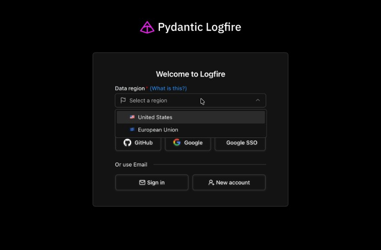

# Data Regions

Logfire is hosted in two separate geographic regions to provide you with options for data residency, compliance with local regulations, and optimal performance.

## Available Regions

|              | URL                                                        | Hosted           |
| ------------ | ---------------------------------------------------------- | ---------------- |
| 🇺🇸 US Region | [logfire-us.pydantic.dev](https://logfire-us.pydantic.dev) | GCP `us-east4` (Virginia)        |
| 🇪🇺 EU Region | [logfire-eu.pydantic.dev](https://logfire-eu.pydantic.dev) | GCP `europe-west4` (Netherlands) |

## Region Separation

Regions are strictly separated with no data sharing between them:

- No data is transferred between regions
- No cookies are shared between regions
- Authentication tokens are region-specific
- User accounts are separate for each region

## Choosing a Region

Logfire is hosted independently in each region at [logfire-us.pydantic.dev](https://logfire-us.pydantic.dev) and [logfire-eu.pydantic.dev](https://logfire-eu.pydantic.dev). When you sign up you'll be asked to pick a region; on return visits, log in directly at your regional URL.

!!! info
    We don't detect your sessions across regions, each region is hosted independently. Bookmark and log in to your regional URL directly — [logfire-us.pydantic.dev](https://logfire-us.pydantic.dev) or [logfire-eu.pydantic.dev](https://logfire-eu.pydantic.dev).

Consider the following factors when selecting a region:

- **Geographic proximity**: Choose a region closer to your location or your users for optimal performance
- **Data residency requirements**: Select the region that aligns with your regulatory compliance needs
- **GDPR compliance**: Companies requiring GDPR compliance are advised to use the EU region

## Connecting the SDK and API

When you run `logfire auth` and create a project, the SDK picks up the right region automatically from your write token. You don't need to configure a base URL.

You only need your region's URL when talking to Logfire from outside the Python SDK:

- [Alternative Clients](../how-to-guides/alternative-clients.md) — OTLP and non-Python SDKs
- [Query API](../how-to-guides/query-api.md) — read your data over HTTP
- [MCP Server](../how-to-guides/mcp-server.md) — connect an LLM client

## Multiple Regions

You can have accounts in both regions if needed for different projects or teams. Each account is managed separately, with its own authentication and data.

## Region Migration

Migration between regions is not currently available but we hope to make it possible in the future.

## How does this Impact Pricing?

Pricing is the same between the US and EU instances.
