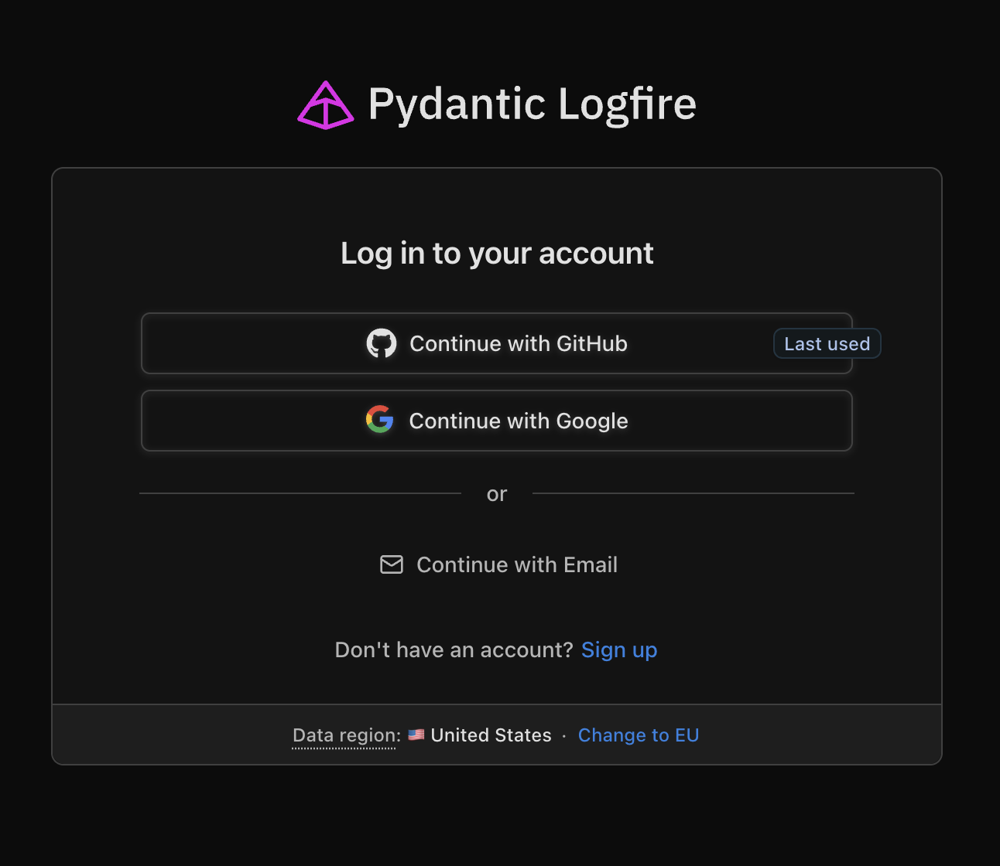

# Data Regions

Logfire is hosted in two separate geographic regions to provide you with options for data residency, compliance with local regulations, and optimal performance.

## Available Regions

|              | URL                                                        | Hosted           |
| ------------ | ---------------------------------------------------------- | ---------------- |
| 🇺🇸 US Region | [logfire-us.pydantic.dev](https://logfire-us.pydantic.dev) | GCP `us-east4` (Virginia)        |
| 🇪🇺 EU Region | [logfire-eu.pydantic.dev](https://logfire-eu.pydantic.dev) | GCP `europe-west4` (Netherlands) |

## Region Separation

Regions are strictly separated with no data sharing between them:

- No data is transferred between regions
- No cookies are shared between regions
- Authentication tokens are region-specific
- User accounts are separate for each region

## Choosing a Region

Logfire is hosted independently in each region at [logfire-us.pydantic.dev](https://logfire-us.pydantic.dev) and [logfire-eu.pydantic.dev](https://logfire-eu.pydantic.dev). Your region follows the URL you sign up at, so go to the URL for the region you want. The sign-up and log-in screens show the region you are about to use at the foot of the card, with a link to switch to the other one.

Your account is created in whichever region you sign up at, and [migration between regions is not currently available](#region-migration), so make sure the stated region is the one you want before you continue.

!!! tip "Signing in to Logfire"
    We don't detect your sessions across regions; each region is hosted independently. Bookmark and sign in to your regional URL directly: [logfire-us.pydantic.dev](https://logfire-us.pydantic.dev) or [logfire-eu.pydantic.dev](https://logfire-eu.pydantic.dev).

    If you sign in and your projects are missing, you are probably in the other region. Check the region shown at the foot of the sign-in card and use the switch link.

Consider the following factors when selecting a region:

- **Geographic proximity**: Choose a region closer to your location or your users for optimal performance
- **Data residency requirements**: Select the region that aligns with your regulatory compliance needs
- **GDPR compliance**: Companies requiring GDPR compliance are advised to use the EU region

## Connecting the SDK and API

When you run `logfire auth` and create a project, the SDK picks up the right region automatically from your write token. You don't need to configure a base URL.

You only need your region's URL when talking to Logfire from outside the Python SDK:

- [Alternative Clients](../how-to-guides/alternative-clients.md): OTLP and non-Python SDKs
- [MCP Server](../how-to-guides/mcp-server.md): connect an LLM client

## Multiple Regions

You can have accounts in both regions if needed for different projects or teams. Each account is managed separately, with its own authentication and data.

## Region Migration

Migration between regions is not currently available but we hope to make it possible in the future.

## How does this impact Pricing?

Pricing is the same between the US and EU instances.

## Other hosting options

If you need a specific GCP region, stricter isolation, or your own infrastructure:

- **[Enterprise Single-Tenant](../enterprise-single-tenant.md)**: dedicated single-tenant Logfire managed by Pydantic, deployable to any GCP region.
- **[Enterprise Self-Hosted](../enterprise.md#enterprise-self-hosted)**: run Logfire on your own infrastructure via our Helm chart.
