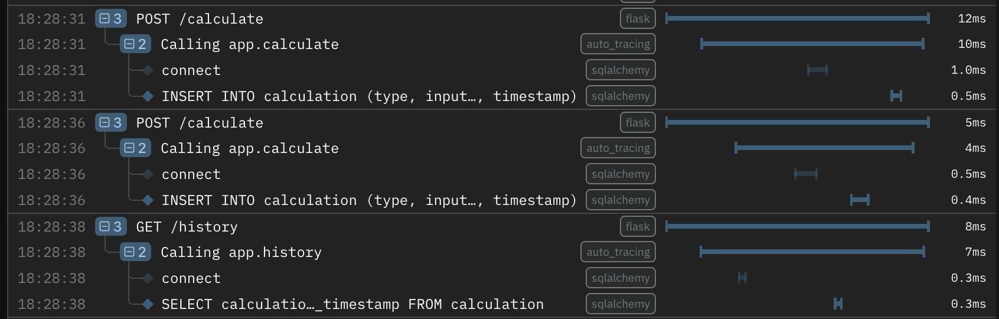

# Examples

These are working, standalone applications and projects that you can clone, run
locally, and experiment with to explore Logfire's various capabilities.

**Have a suggestion?**

If you'd like to see an example in a particular language or using a specific
library, [get in touch](../help.md).

## Python

### Flask and SQLAlchemy Example

This example demonstrates a simple Python financial calculator application built
with Flask and SQLAlchemy. It's instrumented using the appropriate integrations
and [auto-tracing](../guides/onboarding-checklist/add-auto-tracing.md). When you
run the server locally and interact with the calculator, you'll see traces being
automatically generated:

[View on GitHub :material-open-in-new:](https://github.com/pydantic/logfire/tree/main/examples/python/flask-sqlalchemy/){:target="_blank"}

## JavaScript/TypeScript

Logfire provides a [JavaScript SDK](https://github.com/pydantic/logfire-js) that
enables instrumentation of JavaScript/TypeScript applications. For
implementation details and examples, please refer to the
[package README](https://github.com/pydantic/logfire-js?tab=readme-ov-file#usage).
