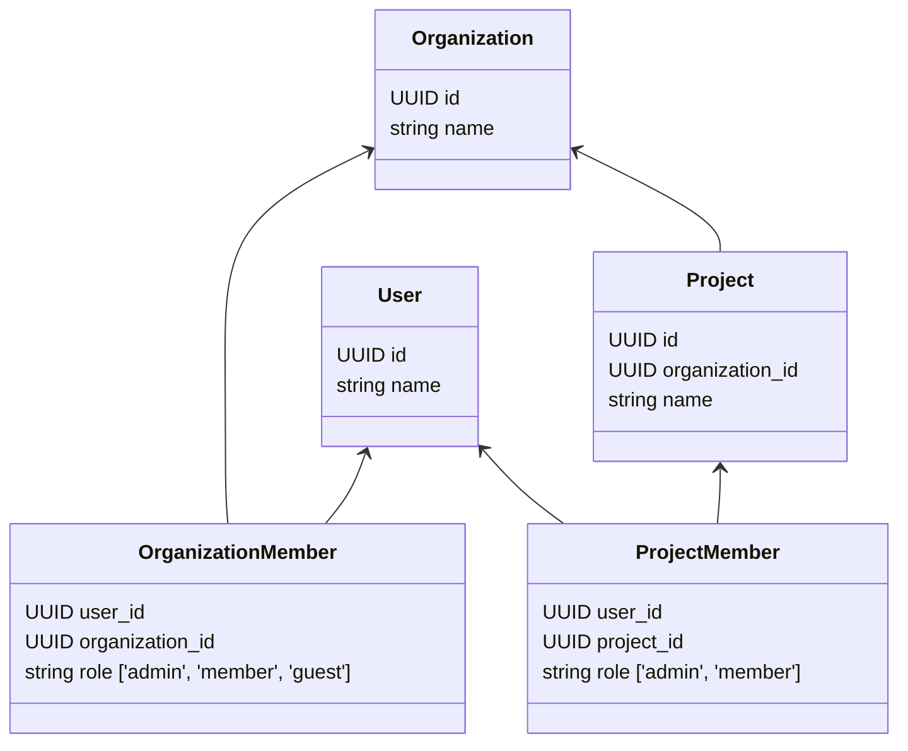

The following diagram shows the structure of an organization in **Logfire**:

As a **user**, you can be a member of multiple **organizations**. On each **organization**, you can either be:

- [X] An **admin**: who can manage the organization and its projects.
- [X] A **member**: who can only view the organization and the projects that are shared with them.
- [X] A **guest**: who can only view the projects that are shared with them.

An **admin** can invite other users to join the organization.
When a user accepts the invitation, they become a **member** of the organization.

Each **organization** can have multiple **projects**. On each **project**, you can either be:

- [X] An **admin**: who can manage the project.
- [X] A **member**: who can only view the project.

If a user is invited to join a project, they become a **member** of the project, but they are a **guest** in the organization.

---

## Organization Types

Logfire has a similar structure to Github in that you have a personal org, and then can create
and/or belong to many other normal (i.e. non-personal) orgs. Both org types are functionally the same in that
you can invite others to join them.

### Which Org Type Should You Use?
Whilst you *can* use your personal org for production use-cases (e.g. if you
are working alone or in a small team), you may wish to switch your personal org to a normal org if you are working
at a larger company and want to create a more "official" Logfire org for that company. This also means you don't have
to share your personal org's projects (which you may wish to keep private) with any colleagues.

### How Do I Switch from Personal to Normal Org?
In the org settings, you will find a section called "Convert to org", which will take you through a brief series of
steps where you will:

- Define your new (normal) organization's name and slug
- Edit the name of your personal org if you wish

After you do this, all projects, members, alerts, dashboards and settings will be migrated to the new org. You will
be the owner of the new org.
