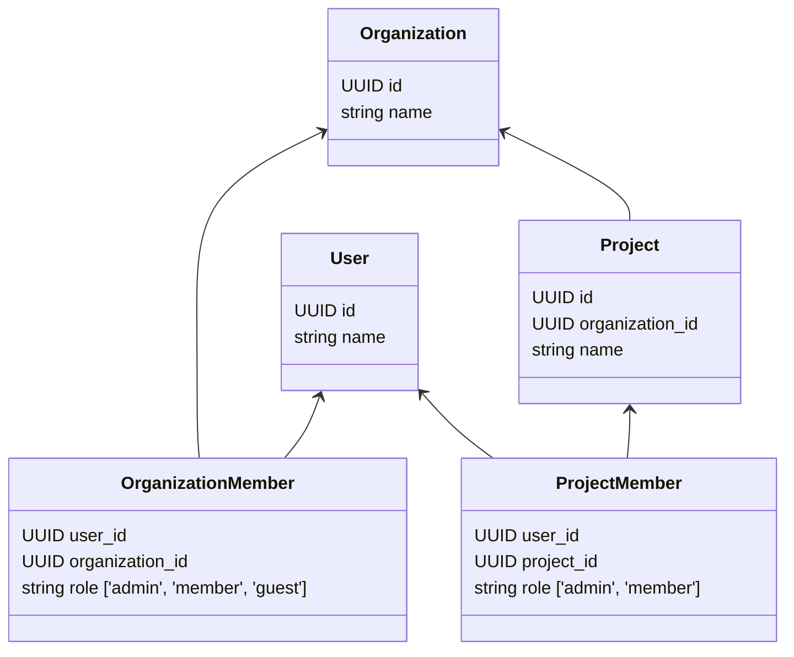

The following diagram shows the structure of an organization in **Logfire**:

As a **user**, you can be a member of multiple **organizations**. On each **organization**, you can either be:

- [X] An **admin**: who can manage the organization and its projects.
- [X] A **member**: who can only view the organization and the projects that are shared with them.
- [X] A **guest**: who can only view the projects that are shared with them.

An **admin** can invite other users to join the organization.
When a user accepts the invitation, they become a **member** of the organization.

Each **organization** can have multiple **projects**. On each **project**, you can either be:

- [X] An **admin**: who can manage the project.
- [X] A **member**: who can only view the project.

If a user is invited to join a project, they become a **member** of the project, but they are a **guest** in the organization.
