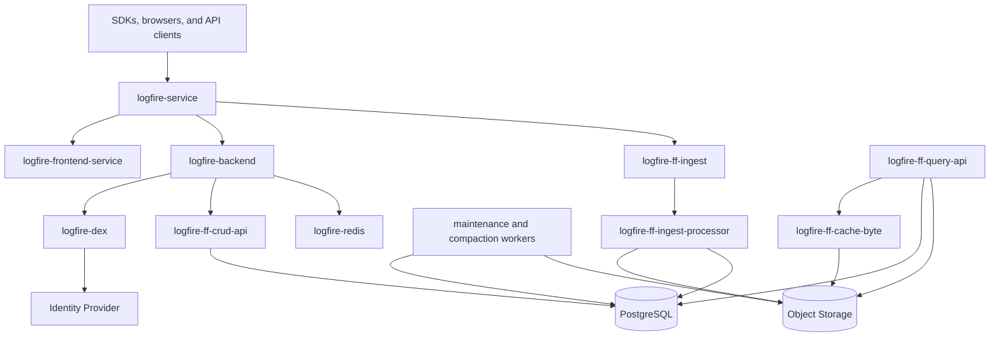

# Self-Hosted Logfire Architecture

Self-hosted Logfire is made up of independent Kubernetes workloads plus production infrastructure that you provide. The exact rendered workloads depend on the Helm chart version and feature flags, so use the [Logfire Helm chart README](https://github.com/pydantic/logfire-helm-chart) and values reference for chart-version-specific details.

## Runtime Flow

## Workload Groups

* Edge and frontend: `logfire-service` routes public traffic; `logfire-frontend-service` serves frontend assets.
* Application backend: `logfire-backend` handles application APIs, authentication integration, and UI backend behavior.
* Ingest path: `logfire-ff-ingest` receives telemetry; `logfire-ff-ingest-processor` processes and writes it.
* Query path: `logfire-ff-query-api` reads telemetry from object storage and metadata from PostgreSQL. Some deployments can also render `logfire-ff-query-worker`.
* Metadata APIs: `logfire-ff-crud-api` handles project, organization, dashboard, and related metadata operations.
* Cache and coordination: `logfire-ff-cache-byte` backs query caching; `logfire-redis` supports live query streaming and autocomplete cache.
* Background work: `logfire-ff-maintenance-worker` and `logfire-ff-compaction-worker` handle maintenance and compaction.
* Identity: `logfire-dex` integrates Logfire with your identity provider.
* Internal telemetry: `logfire-otel-collector` sends Logfire's own telemetry to the meta project.
* Optional features: the chart can render feature-specific workloads such as `logfire-remote-mcp` and `logfire-ai-gateway`.

## External Dependencies

Self-hosted Logfire depends on production-grade infrastructure outside the chart:

* PostgreSQL stores application metadata, identity data, and FusionFire metadata for files in object storage.
* Object storage stores telemetry data.
* An identity provider supplies user authentication through Dex.
* Ingress, Gateway API, or your routing layer exposes `logfire-service` on a stable hostname.

Telemetry payloads are stored in object storage, not PostgreSQL.
