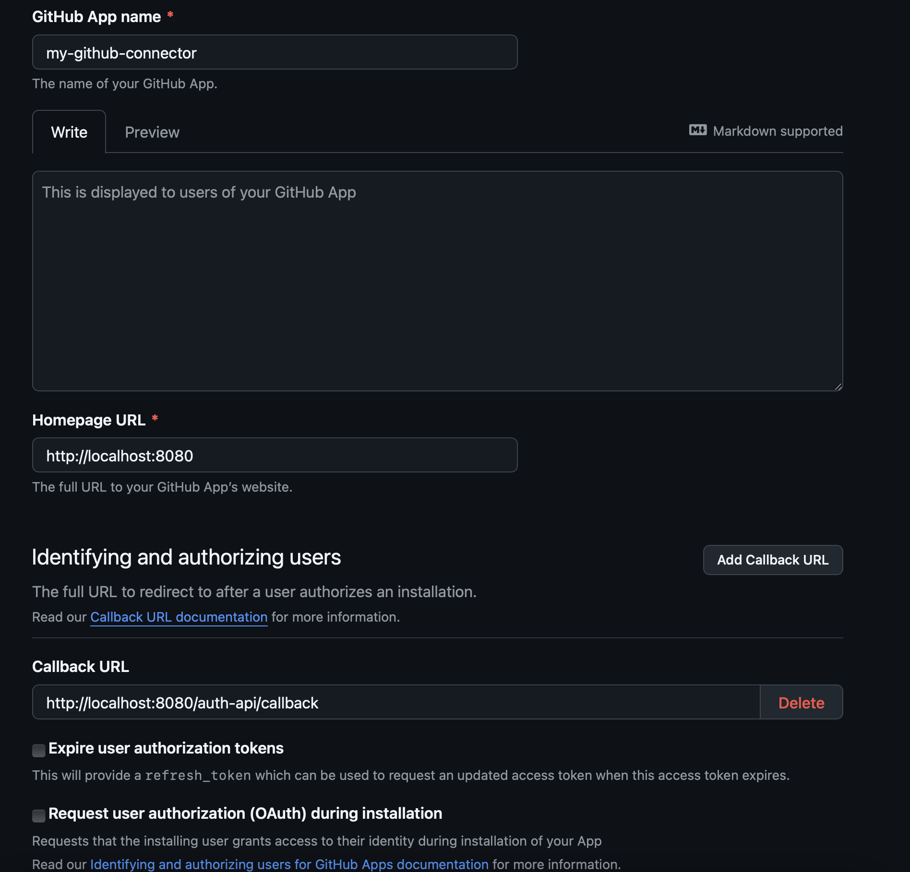
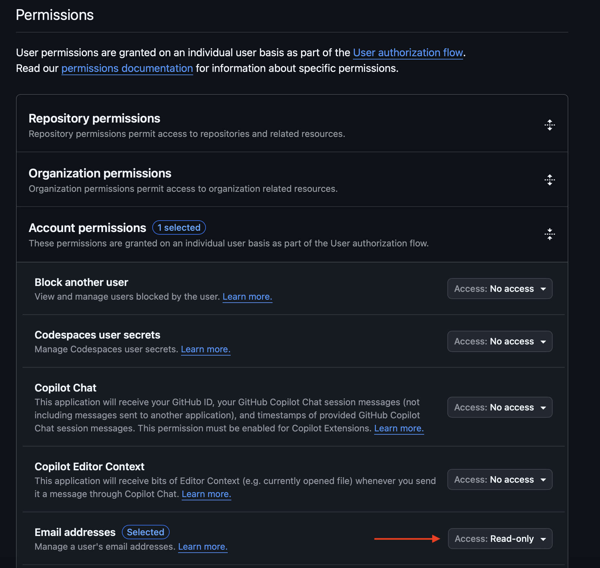
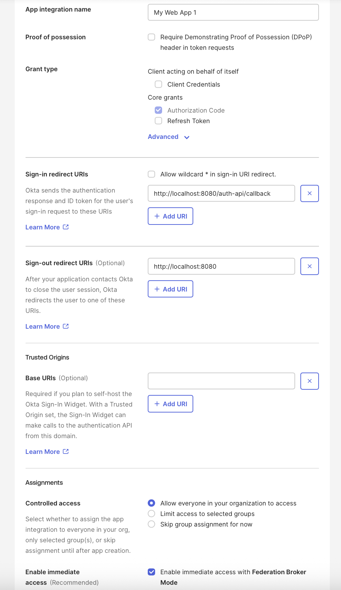
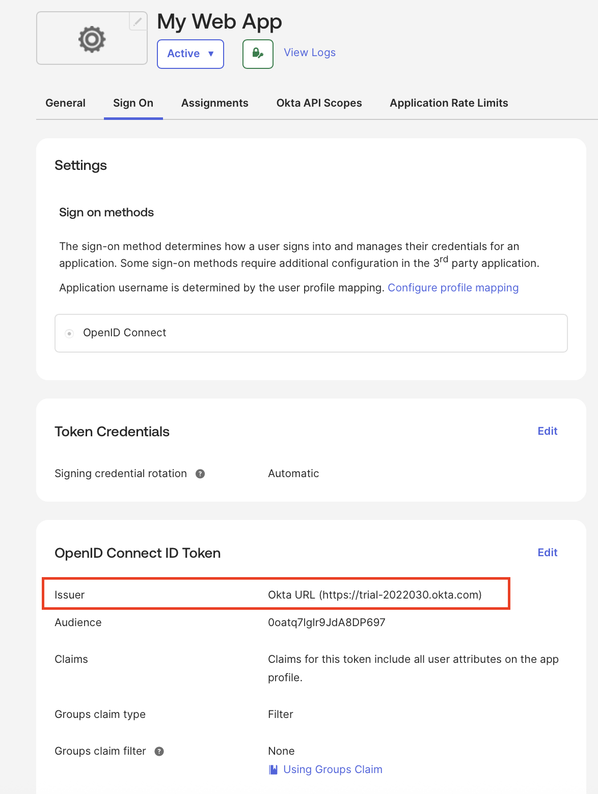

# Examples

This page provides some example configuration for different scenarios.

---

## Auth

Examples for configuring different [Dex connectors](https://dexidp.io/docs/connectors/)

### Azure

For Azure, we recommend creating an [OpenID connector](https://dexidp.io/docs/connectors/oidc/).

- Follow the steps to create the Azure App at [Azure Docs](https://learn.microsoft.com/en-us/power-pages/security/authentication/openid-settings#create-an-app-registration-in-azure)

    - Make sure to set the **RedirectURI** to ```<logfire_url>/auth-api/callback```
    - Make sure to copy the secret value when you create it

- To finish the configuration on your Helm values file, you will need:
    - Directory (Tenant) ID and  Application (client) ID, you can get both of these from the Azure App overview page
    - The client secret value you copied on the previous step

It should look something like this:
```yaml
    logfire-dex:
      config:
        connectors:
        - type: oidc
          id: azuread
          name: Microsoft
          config:
            issuer: https://login.microsoftonline.com/<tenant_id>/v2.0
            clientID: <App client ID>
            clientSecret: <Client secret value>
            insecureSkipEmailVerified: true
```

### Github

For GitHub you can use the [GitHub connector](https://dexidp.io/docs/connectors/github/)

- Follow the steps for creating an OAuth app [in the GitHub docs](https://docs.github.com/en/apps/oauth-apps/building-oauth-apps/creating-an-oauth-app)

    

    !!! note
        Make sure to set the callback URL to ```<logfire_url>/auth-api/callback```

    
    !!! note
        For personal apps, setting at least email read access is required here. For Organizations, this is not needed.

- After creating the app, on the ```General``` tab at the left, at the Client secrets section, click ```Generate a new client secret```, and copy the value.

- On your values file:
    ```yaml
      logfire-dex:
        config:
          connectors:
          - type: github
            id: github
            name: GitHub
            config:
              # You get clientID and clientSecret by creating a GitHub OAuth App
              # See https://docs.github.com/en/apps/oauth-apps/building-oauth-apps/creating-an-oauth-app
              clientID: client_id
              clientSecret: client_secret
    ```

### Okta

we recommend creating an [OpenID connector](https://dexidp.io/docs/connectors/oidc/).

- Follow the steps for creating an OIDC Okta App at [Okta Docs](https://help.okta.com/en-us/content/topics/apps/apps_app_integration_wizard_oidc.htm)
    - Set **Web Application** as the Application type
    - Set **Sign-in redirect URIs** to ```<logfire_url>/auth-api/callback```

    

- After creating the app:
    - Copy the Client ID from the **General** tab
    - Copy the Secret value
    - Go to the **Sign On** tab, click **Edit** at the **OpenID Connect ID Token** section and change **Issuer** from **Dynamic** to **Okta URL**, then copy the URL

    

- Now, finish the configuration on your Helm values file, it should look something like this:
    ```yaml
      logfire-dex:
        config:
          connectors:
          - type: oidc
            id: okta
            name: Okta
            config:
              issuer: <Issuer_URL> ### This is the URL from the Sign On tab
              clientID: <Client ID>
              clientSecret: <Client secret value>
              insecureSkipEmailVerified: true
    ```
