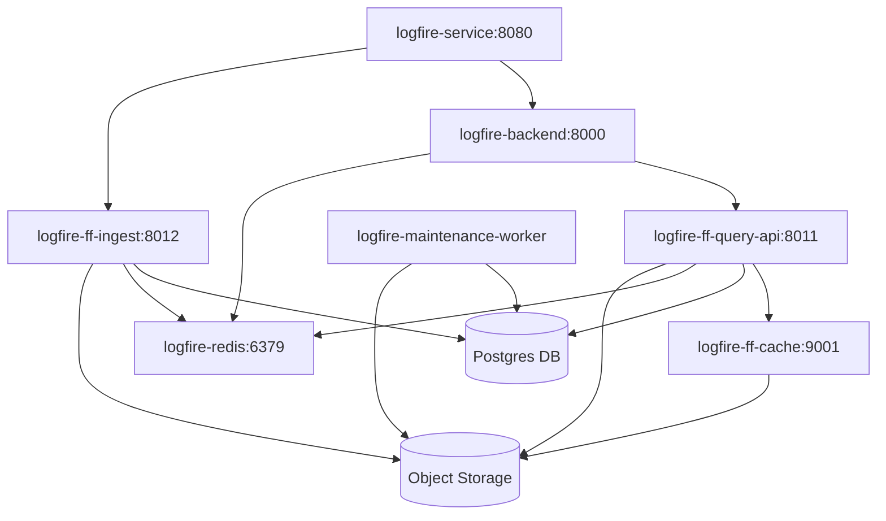

# Self Hosted Introduction

Logfire can be deployed on-premises using the official [Logifre Helm Chart](https://github.com/pydantic/logfire-helm-chart). This allows organizations the ability to fully manage their own data.

This chart is included in our [Enterprise plan](../../enterprise.md). Contact us at [sales@pydantic.dev](mailto:sales@pydantic.dev) for details.

### Key Benefits

* **Simplified Deployment:** Install and manage the entire application stack with a single command.
* **Flexible Configuration:** Easily adjust resource allocation, ingress settings, and authentication to your needs.
* **Production-Ready Defaults:** Built-in settings for high availability, resource limits, and health checks.
* **Repeatable & Versioned:** Manage your application deployment as code, ensuring consistency across environments.
* **Compliance Friendly:** Leverage your own infrastructure to meet internal security standards.

## System Requirements

**Logfire** has been built from the ground up to be horizontally scalable. The self-hosted version shares the same code as the public deployment, and so is able to scale to high volumes of traffic.

With that in mind, here are some minimum requirements that you will need to deploy logfire self-hosted:

- A **Kubernetes** Cluster version `1.32` or greater
- A **PostgreSQL** Database version `16` or greater
- **Object Storage** such as Amazon S3, Azure Blob Storage or Google Cloud Storage
- At least `512GB` or more local SSD scratch disk for ingest, compaction and caching
- A **DNS/Hostname** to serve Logfire on. This does not need to be Internet accessible, but will need to be accessed over HTTP from any client.
- An **Identity Provider** for Authenticating Users such as Github, Google or Microsoft.  **Logfire** uses [Dex for authentication](https://dexidp.io/docs/connectors/)

Please view [installation](./installation.md) to find out how each of these are used.

## Client Configuration Instructions

After setting up the chart, you can send data to your **Logfire** Self-hosted instance by specifying the base url in advanced options:

```python
import logfire

logfire.configure(
    ..., # other options
    advanced=logfire.AdvancedOptions(base_url="https://<your_logfire_hostname>")
)
```

## Service Architecture

The Self-hosted deployment has a number of interdependent services that work to run logfire.  Each component can be scaled independently of others depending on the utilisation of the system.

### Service Dependency Diagram



### Service Descriptions

#### Entry Point
- `logfire-service` (Port 8080): Main entry point for the system

#### Core Services
- `logfire-backend` (Port 8000): Backend service handling business logic, frontend and authentication
- `logfire-ff-ingest` (Port 8012): API for data ingestion
- `logfire-ff-query-api` (Port 8011): API for querying data
- `logfire-ff-maintenance-worker`: Maintenance Jobs
- `logfire-ff-compaction-worker`: Compaction Jobs
- `logfire-redis`: Live query streaming and autocomplete cache
- `logfire-ff-cache` (Port 9001 via `logfire-ff-conhash-cache` consistent hashing): Cache service
