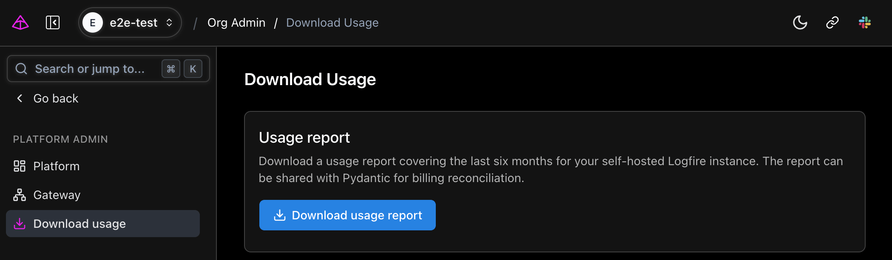

# Download Usage Report

This page shows you how to download your usage report from your self-hosted Logfire instance.

---

## Access the Meta Organization

First, log in to your `logfire-meta` organization.
If you've never done this, see [Accessing the Meta Organization](./troubleshooting.md#accessing-the-meta-organization) for a quick way in.

!!! note
    We recommend generating an invite link to invite your own users so you don't have to use the above method again.

## Download the Usage Report

1. Open the **Settings** menu.
2. Under **Platform admin**, select **Download usage**.
3. Click the **Download usage report** button.

The report covers the last six months for your self-hosted Logfire instance and can be shared with Pydantic for billing reconciliation.

