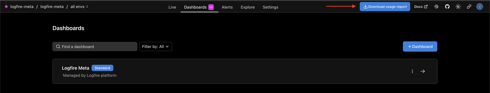

# Download Usage Report

This page shows you how to download your usage report from your self-hosted logfire instance.

---

## Access the Meta Organization

First, you need to login to your ```logfire-meta``` organization.
If you never did this, you can check [Accessing the Meta Organization](./troubleshooting.md#accessing-the-meta-organization) for a quick way to access.
!!! note
    We recommend generating an invite link to invite your own users so you don't have to use the above method again.

Once inside the Meta Org, access the ```logfire-meta``` project (```https://<your-logfire-hostname>/logfire-meta/logfire-meta```) and you will see the **Download usage report** button at the top-right corner 
