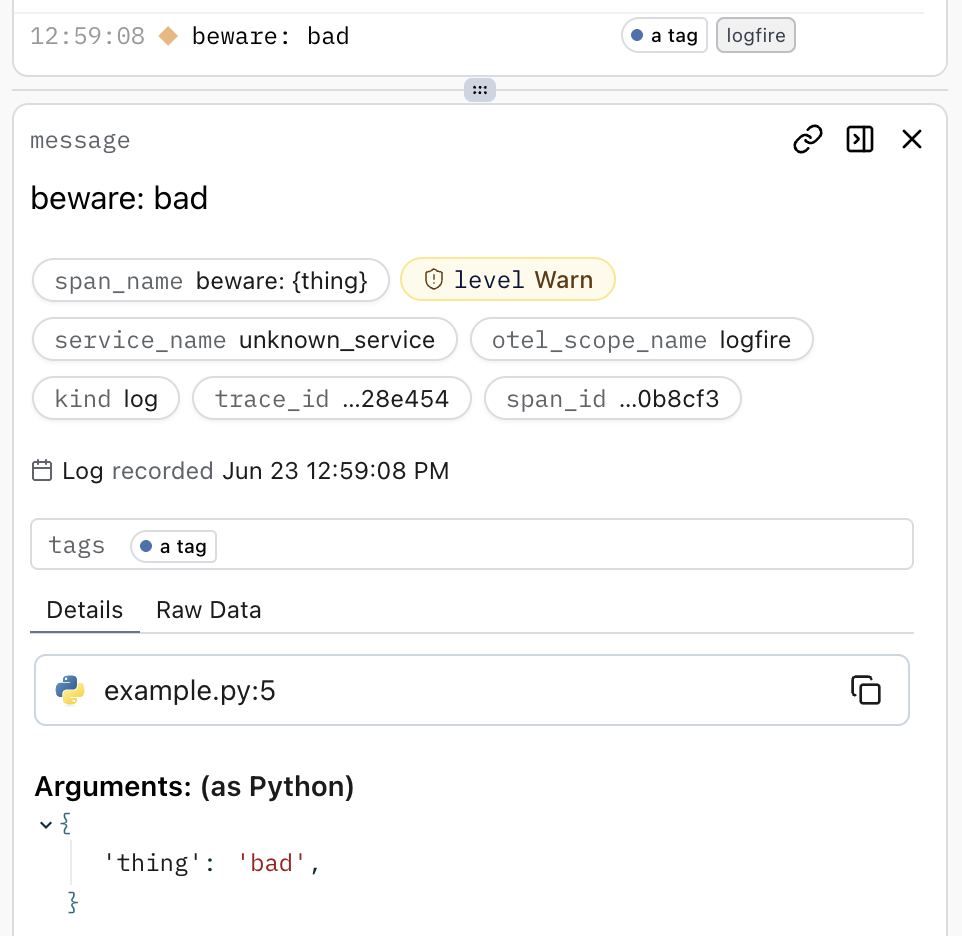
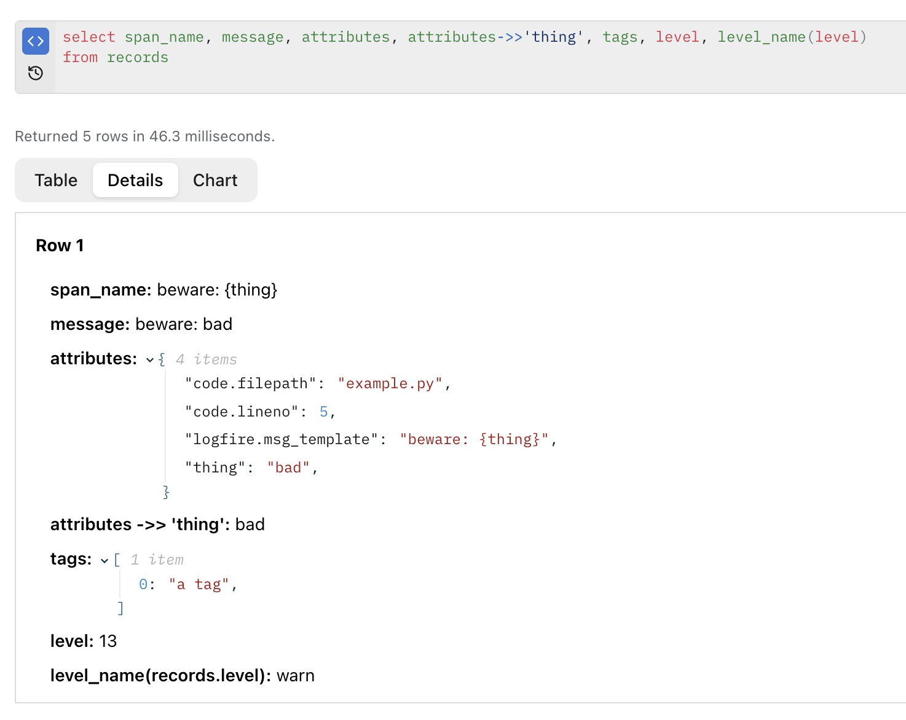
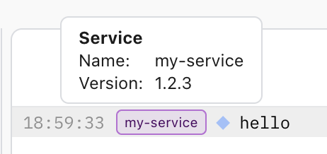
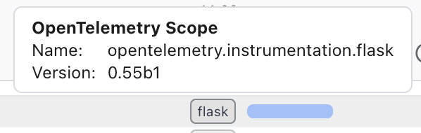

# SQL

## Syntax

**Logfire** lets you query your data using SQL. The underlying database is Apache DataFusion, so the primary reference for the SQL syntax can be found in their [SQL Language Reference](https://datafusion.apache.org/user-guide/sql/index.html). However it's generally meant to match [PostgreSQL syntax](https://www.postgresql.org/docs/current/queries.html) which is easier to look up. We also extend it in various ways, particularly with [JSON functions and operators](https://github.com/datafusion-contrib/datafusion-functions-json) such as `->>`.

## Tables

Data is stored in two main tables: `records` and `metrics`.

`records` is the table you'll usually care about and is what you'll see in the Live View. Each row in `records` is a span or log (essentially a span with no duration). A _trace_ is a collection of spans that share the same `trace_id`, structured as a tree.

`metrics` contains pre-aggregated numerical data which is usually more efficient to query than `records` for certain use cases. There's currently no dedicated UI for metrics, but you can query it directly using SQL in the Explore view, Dashboards, Alerts, or the API, just like you would with `records`.

Technically `records` is a subset, the full table is called `records_full` which includes additional rows called pending spans, but you can ignore that for most use cases.

## `records` columns

### Basic

To demonstrate some commonly used columns, if you run this script:

```python
import logfire

logfire.configure()

logfire.warn('beware: {thing}', thing='bad', _tags=['a tag'])
```

You will see this in the Live view:



Here's an example of querying in the Explore view:



#### `span_name`

This is a string label which is typically shared by similar records. Clicking the `span_name` bubble in the details panel of the Live view will give you a few options to filter by that span name, which is a good way to find other records like this one. It should be _low cardinality_, meaning there shouldn't be too many unique values.

When using methods from the **Logfire** SDK, this will usually be the template without any arguments filled in, e.g. above it's `'beware: {thing}'`.

In HTTP server request spans, this is usually the HTTP method and route, e.g. `'GET /users/{id}'`. Note that it doesn't use the actual path (e.g. `/users/123`).

In database query spans, this is usually just the operation, e.g. `'SELECT'`, `'INSERT'`, or `'UPDATE'`.

See the docs on [messages and span names](../guides/onboarding-checklist/add-manual-tracing.md#messages-and-span-names) and the [OpenTelemetry spec](https://opentelemetry.io/docs/specs/otel/trace/api/#span) for more details.

#### `message`

This is a human-readable description of the record. It's the text in each line of the list of records in the Live view.

Typically this is similar to the `span_name` but with any arguments filled in, e.g. above it's `'beware: bad'`.

In HTTP server request spans, this is usually the HTTP method and route with the actual path filled in, e.g. `'GET /users/123'`.

In database query spans from the Python **Logfire** SDK, this is usually a _summary_ of the SQL query. This can be useful for finding and grouping records with similar but slightly different queries.

It's usually faster and more correct to use `span_name` in queries. `message` is primarily for human readability and is more likely to change over time. But if you want to query it, you probably want to use the `LIKE` (or `ILIKE` for case-insensitive) SQL operator, e.g. `WHERE message LIKE '%bad%'` to find all records where `message` contains the substring `bad`.

OpenTelemetry doesn't have a native 'message' concept. To set a value for the `message` column when using other OpenTelemetry SDKs, set the attribute `logfire.msg`. This will not be kept in the `attributes` column.

#### `attributes`

This is a JSON object containing arbitrary additional structured data about the record. It can vary widely between records and even be empty.

You can query it using the `->>` operator, e.g. above `attributes->>'thing' = 'bad'` (note the single quotes, `"thing"` or `"bad"` would look for SQL columns with those names and fail) would match our record because of the `thing='bad'` argument in the `logfire.warn()` call. For nested JSON, you can chain multiple `->>` operators, e.g. `attributes->>'nested'->>'key'`. You can also use `->` which is mostly interchangeable, but if you get weird errors about types, try using `->>` instead.

See the [manual tracing docs on attributes](../guides/onboarding-checklist/add-manual-tracing.md#attributes) for more information about setting attributes in the **Logfire** SDK.

Note that arguments passed directly to the **Logfire** SDK methods are shown under 'Arguments' in the Live view details panel, but they are still stored in the same `attributes` column.

#### `tags`

This is an optional array of strings that can be used to group records together.

Each tag is displayed as a colored bubble in the Live view after the message.

To find records with the same tag, use the `array_has` function, e.g. `array_has(tags, 'a tag')` in the above example.

To set a tag in the Python **Logfire** SDK, pass a list of strings to the `_tags` argument in the SDK methods. Note the leading underscore. Alternatively, [`logfire.with_tags('a tag')`][logfire.Logfire.with_tags] will return a new `Logfire` instance with all the usual methods, where `'a tag'` will be automatically included in the tags of all method calls.

OpenTelemetry doesn't have a native 'tags' concept. To set a value for the `tags` column when using other OpenTelemetry SDKs, set the attribute `logfire.tags`. This will not be kept in the `attributes` column.

#### `level`

This represents the severity level (aka the 'log level') of the record.

It's stored in the database as a small integer so that it supports operators like `>=` and `<`, but we provide some SQL magic to allow you to use the string names in comparisons. For example, `level = 'warn'` will match the example record above, even though the actual stored value is `13`. A common useful query is `level > 'info'` to find all 'notable' records like warnings and errors.

The level is most commonly set by using the appropriate method in the **Logfire** SDK, e.g. `logfire.warn(...)` or `logfire.error(...)`, but there are [several other ways](../guides/onboarding-checklist/add-manual-tracing.md#log-levels).

The default level for spans is `info`. If a span ends with an unhandled exception, the level is usually set to `error`. One special case is that FastAPI/Starlette `HTTPException`s with a 4xx status code (client errors) are set to `warn`.

You can convert level names to numbers using the `level_num` SQL function, e.g. `level_num('warn')` returns `13`.

You can also use the `level_name` SQL function to convert numbers to names, e.g. `SELECT level_name(level), ...` to see a human-readable level in the Explore view.

The numerical values are based on the [OpenTelemetry spec](https://opentelemetry.io/docs/specs/otel/logs/data-model/#field-severitynumber). Some common values: `info` is `9`, `warn` is `13`, and `error` is `17`.

OpenTelemetry _logs_ have a native severity level, but _spans_ do not. Spans with a status code of `ERROR` will have a level of `error`, otherwise the level is set to `info`. To set a custom value for the `level` column when using other OpenTelemetry SDKs, set the attribute `logfire.level_num`. This will not be kept in the `attributes` column.

### Span tree

#### `trace_id`

This is a unique identifier for the trace that this span/log belongs to.

A trace is a collection of one or more records that share the same `trace_id`, structured as a tree. It typically represents one high level operation such as an HTTP server request or a batch job.

If you query individual records in the explore view, dashboard tables, or alerts, we recommend including `trace_id` in the `SELECT` clause. The values will become clickable links in the UI that will take you to the Live view filtered by that trace, making it easy to explore a record in context. For alerts sent as slack messages, note that this doesn't apply to the slack message itself, but the title of the slack message will link to the alert run results in the UI, and the table there will have clickable `trace_id` links.

Technically the trace ID is a 128-bit (16 byte) integer, but in the database it's represented as a 32-character hexadecimal string. For example, the following code:

```python
from opentelemetry.trace import format_trace_id

import logfire

logfire.configure()

with logfire.span('foo') as span:
    trace_id = span.get_span_context().trace_id
    print(trace_id)
    print(format_trace_id(trace_id))
```

will print something like:

```
2116451560797328055476200846428238844
01979d1e4e4325335569dba4459473fc
```

The second line is what you'll see in the database and UI.

Most OpenTelemetry SDKs generate trace IDs that are completely random. However, the Python **Logfire** SDK generates trace IDs where the first few characters are based on the current time. This means that if you want to quickly check at a glance if two records are part of the same trace, it's better to look at the _last_ characters.

#### `span_id`

This is a unique identifier for a single span/log within a trace.

To filter down to a specific record, use a combination of `trace_id` and `span_id`, e.g. `WHERE trace_id = '01979d1e4e4325335569dba4459473fc' AND span_id = 'a1b2c3d4e5f6g7h8'`. Querying only by `span_id` is significantly less efficient and might not always be correct. Because of this, while `span_id` will produce clickable links in the same way as `trace_id`, it will only do so if the `trace_id` column is also present.

Technically the span ID is a 64-bit (8 byte) integer, but in the database it's represented as a 16-character hexadecimal string, similar to the trace ID, but shorter.

#### `parent_span_id`

All spans in a trace are structured as a tree, where each span can have zero or more child spans, and all spans except the root span have a single parent span identified by `parent_span_id`.

To filter down to only root spans, use `WHERE parent_span_id IS NULL`.

If you need to work with data that's spread across pairs of parent/child spans, use a `JOIN` on the `records` table that checks both `trace_id` and `parent_span_id`, e.g.:

```sql
SELECT
    parent_records.message AS parent_message,
    child_records.message  AS child_message
FROM records parent_records
JOIN records child_records
    ON  child_records.trace_id       = parent_records.trace_id
    AND child_records.parent_span_id = parent_records.span_id
```

For example this code:

```python
with logfire.span('parent'):
    logfire.info('child')
```

with the above query will return a single row with `parent_message` set to `'parent'` and `child_message` set to `'child'`.

If you find yourself needing to do this, consider using [Baggage](https://logfire.pydantic.dev/docs/reference/advanced/baggage/) instead.

### Timestamps

#### `start_timestamp`

The UTC time when the span/log was first created/started.

This is the time shown on the left side of the list of records in the Live view.

All views in the UI have some time range dropdown that filters on this column, so you usually don't have to. For example, in the Live view the default is set to 'Last 5 minutes'. But if you wanted to do this manually in SQL, you could use a `WHERE` clause like `start_timestamp >= now() - interval '5 minutes'`.

In dashboard queries, a time series chart querying `records` should have `time_bucket($resolution, start_timestamp)` in the `SELECT` clause, which will be used as the x-axis. `$resolution` is a variable that will be replaced with the time resolution of the dashboard, e.g. `1 minute`. This variable doesn't exist outside of dashboards, so if you want to copy a query from a dashboard to the Explore view, tick 'Show rendered query' first. This will fill in the variable with the actual value, e.g. `time_bucket('1 minute', start_timestamp)`.

!!! warning
    Prefer this column over `created_at`, which is an internal timestamp representing when the record was created in the database.

!!! warning
    The `metrics` table also has a `start_timestamp` column, but you should usually use `recorded_timestamp` instead, which doesn't exist in the `records` table.

#### `end_timestamp`

The UTC time when the span/log was completed/ended.

For logs, this is the same as `start_timestamp` because logs don't have a duration.

#### `duration`

The time in seconds between `start_timestamp` and `end_timestamp`.

For example, `duration > 2` will match all spans that took longer than 2 seconds to complete.

For logs, this is always `null`. Otherwise it's equivalent to `EXTRACT(EPOCH FROM (end_timestamp - start_timestamp))`.

### Exceptions

#### `is_exception`

This is a boolean column which is true when an exception is recorded on the span/log.

This usually applies to spans that ended with an unhandled exception, or logs that were created with the method `logfire.exception(...)`. See the [manual tracing docs on exceptions](../guides/onboarding-checklist/add-manual-tracing.md#exceptions) for other possible ways that exceptions can be recorded.

Exceptions usually represent errors, but not always. To filter down to exceptions that are errors, use `WHERE is_exception AND level >= 'error'`. Also note that error logs are not always exceptions, e.g. `logfire.error(...)` does not set `is_exception` to true.

If `is_exception` is false, the other columns in this section will be `null`.

Technically, an exception being recorded on a span means that there's a span event (an item in the `otel_events` column) with the name `exception`. The remaining columns in this section are derived from attributes of the first such event. In the unlikely case that there are multiple `exception` events, we _might_ change which event is used in the future to derive the other columns.

#### `exception_type`

This is the fully qualified name of the exception class, e.g. `ValueError` or `fastapi.exceptions.HTTPException`.

It's derived from the `exception.type` attribute of the `exception` span event.

#### `exception_message`

This is the message of the exception, e.g. this code:

```python
import logfire

logfire.configure()

with logfire.span('my pan'):
    raise ValueError('oops')
```

will produce a record with `exception_message` set to `'oops'`.

Note that this can be an empty string if the exception has no message, e.g. `raise ValueError()`. This is different from `null`, which means that the record is not an exception.

This is derived from the `exception.message` attribute of the `exception` span event.

#### `exception_stacktrace`

This is the fully formatted traceback of the exception, usually a long multiline string. It can be very useful to look at, but isn't great for querying.

This is derived from the `exception.stacktrace` attribute of the `exception` span event.

### Resource attributes

#### `otel_resource_attributes`

This is a JSON object containing the [resource attributes](https://opentelemetry.io/docs/concepts/resources/) of the span/log. Typically, all spans/logs produced by a single process will have the same resource attributes.

You can query it using the `->>` operator, similar to the [`attributes`](#attributes) column.

Technically, each call to `logfire.configure()` can create a different set of resource attributes, so it should only be called once if possible.

In **Logfire** and other OpenTelemetry SDKs, you can set arbitrary resource attributes by setting the `OTEL_RESOURCE_ATTRIBUTES` environment variable to a comma-separated list of key-value pairs, e.g. `OTEL_RESOURCE_ATTRIBUTES=service.name=my-service,service.version=1.0.0`.

Metrics and spans/logs produced by the same process will share the same resource attributes, and the `metrics` table has this column as well as many of the others in this section.

All other columns in this section are just convenient aliases for some resource attributes.

#### `deployment_environment`

This represents the environment in which the service is running, e.g. `production`, `staging`, or `development`. See the [Environments guide](../how-to-guides/environments.md) for more details.

This is set to `otel_resource_attributes->>'deployment.environment.name'` if present, falling back to `otel_resource_attributes->>'deployment.environment'` otherwise to accommodate older versions of the OpenTelemetry semantic conventions.

#### `service_name`

This is equivalent to `otel_resource_attributes->>'service.name'`.

This is an optional label identifying the type of service/application that's being run, e.g. `web-api` or `background-worker`. If you run the same code and command over many processes (horizontal scaling) then they should all have the same `service_name`, whereas two processes doing completely different things should ideally have different service names.

In the Live view, this is shown as a colored bubble next to the record's timestamp in the list of records. In the details panel, clicking the `service_name` bubble offers options to copy or filter by that service name.

!!! tip
    Adding a `service_name` filter where possible is a good way to speed up SQL queries.

In the **Logfire** Python SDK, you can set this by passing the `service_name` argument to `logfire.configure()`. Alternatively you can set the `LOGFIRE_SERVICE_NAME` environment variable, or set `service_name` in the `pyproject.toml` file.

For other OpenTelemetry SDKs, use the `OTEL_RESOURCE_ATTRIBUTES` environment variable, e.g. `OTEL_RESOURCE_ATTRIBUTES=service.name`.

If it's not configured, it will usually be set to `unknown_service` as required by the [OpenTelemetry spec](https://opentelemetry.io/docs/specs/semconv/registry/attributes/service/#service-name), in which case no bubble will be shown in the Live view. However some SDKs might add the process executable name after `unknown_service`, e.g. `unknown_service:python`, in which case the bubble will be shown. In this case we recommend setting a proper `service_name` to avoid confusion, or just setting it to `unknown_service` explicitly to hide the bubble if you only have one kind of service.

#### `service_version`

This is equivalent to `otel_resource_attributes->>'service.version'`.

This is an optional label identifying the version of the service/application that's being run, e.g. `1.2.3` or a git commit hash.

In the **Logfire** Python SDK, you can set this by passing the `service_version` argument to `logfire.configure()`. Alternatively you can set the `LOGFIRE_SERVICE_VERSION` environment variable, or set `service_version` in the `pyproject.toml` file. If it's not set, it will try running the `git rev-parse HEAD` command to get the current git commit hash.

For other OpenTelemetry SDKs, use the `OTEL_RESOURCE_ATTRIBUTES` environment variable, e.g. `OTEL_RESOURCE_ATTRIBUTES=service.version=1.2.3`.

In the Live view, if the service name is set, then hovering over the service name bubble will show the service version in a tooltip. For example, this code:

```python
import logfire

logfire.configure(service_name='my-service', service_version='1.2.3')

logfire.info('hello')
```

will show this:



#### `service_instance_id`

This is equivalent to `otel_resource_attributes->>'service.instance.id'`.

This should be a unique identifier for the instance of the service that's running.

In the **Logfire** Python SDK, a random UUID is generated when `logfire.configure()` is called. You can override this by setting the `OTEL_RESOURCE_ATTRIBUTES` environment variable, e.g. `OTEL_RESOURCE_ATTRIBUTES=service.instance.id=my-unique-id-1234`.

#### `process_pid`

This is equivalent to `otel_resource_attributes->>'process.pid'`.

The **Logfire** Python SDK sets this to `os.getpid()` when `logfire.configure()` is called **or when the process gets forked**. This is the only resource attribute that is automatically updated when the process is forked. So while `service_instance_id` is usually unique for different processes, if you also want to distinguish between different forks of the same process, use a combination of `service_instance_id` and `process_pid`. However, beware that [some components of the OpenTelemetry SDK which **Logfire** uses are not fork-safe](https://github.com/open-telemetry/opentelemetry-python/issues/3307).

#### Other resource attributes

The following columns corresponding to OpenTelemetry semantic conventions are also available, but the UI and SDK have no
special support for them:

| Column Name              | Resource attribute name  |
|--------------------------|--------------------------|
| `service_namespace`      | `service.namespace`      |
| `telemetry_sdk_name`     | `telemetry.sdk.name`     |
| `telemetry_sdk_language` | `telemetry.sdk.language` |
| `telemetry_sdk_version`  | `telemetry.sdk.version`  |

### Other columns

#### `otel_scope_name`

This is the name of the OpenTelemetry scope (i.e. the instrumenting library) that produced the span/log.

For example, `logfire.instrument_django()` uses the `opentelemetry.instrumentation.django` module, which is also the name of the scope. So `otel_scope_name = 'opentelemetry.instrumentation.django'` will filter down to Django web requests.

The default value for records produced by **Logfire** SDKs is `logfire`. Specific instrumentations add a suffix, e.g. `logfire.openai`.

You can set a custom suffix with the following code:

```python
import logfire

logfire.configure()

scoped_logfire = logfire.with_settings(custom_scope_suffix='my_scope')

scoped_logfire.info('hello')  # will have the scope `logfire.my_scope`
logfire.info('world')  # will have the scope `logfire`
```

In the Live view, part of the scope is shown as a grey bubble on the right of the record's message. Hovering over it will show the full scope name in a tooltip, along with the `otel_scope_version` if present:



In the details panel of a span in the Live view, clicking the `otel_scope_name` bubble offers options to copy or filter by that scope name.

In other OpenTelemetry SDKs, the scope name is set when obtaining a tracer (from a tracer provider).

#### `otel_scope_version`

This is an optional version of the OpenTelemetry scope (i.e. the instrumenting library) that produced the span/log.

In the live view, the scope name (see above) is shown as a grey bubble on the right of the record's message, and hovering over it will show the scope version in a tooltip.

#### `http_response_status_code`

This is set to `attributes->>'http.response.status_code'` if present, falling back to `attributes->>'http.status_code'` otherwise to accommodate older (but still common) versions of the OpenTelemetry semantic conventions. These attributes are set by HTTP server and client instrumentations, e.g. `logfire.instrument_fastapi()` or `logfire.instrument_httpx()`.

In the live view, this is shown after the message with an arrow, e.g. `GET /users/123 → 200`.

Querying `http_response_status_code >= 400` is a good way to find all HTTP requests where something went wrong.

This column is an integer. If you somehow set the `http.response.status_code` attribute to a string that can't be converted to an integer, then `http_response_status_code` and even `attributes->>'http.response.status_code'` will be `null`, but `(attributes::text)->>'http.response.status_code'` will work.

#### `url_full`

This is set to `attributes->>'url.full'` if present, falling back to `attributes->>'http.url'` otherwise to accommodate older (but still common) versions of the OpenTelemetry semantic conventions. These attributes are set by HTTP server and client instrumentations, e.g. `logfire.instrument_fastapi()` or `logfire.instrument_httpx()`.

#### `log_body`

While the records produced by methods such as `logfire.info()` are typically referred to as 'logs', under the hood they are actually spans with zero duration. OpenTelemetry has a separate concept of 'logs' which are not spans, but which **Logfire** also stores in the `records` table. Logs can have bodies, which are different from attributes and are stored in the `log_body` column.

The body can be a plain string, in which case it will be stored just like that, or it can be a structured object which will be serialized to JSON and can be queried like `attributes` using operators like `->>`.

#### `kind`

This indicates the type of the record. It can be one of the following values:

- `span`: This has a duration and may have children.
- `log`: This may either come from a **Logfire** SDK method like `logfire.info()` which produces zero duration spans with the attribute `logfire.span_type` set to `log`, or it can come from an actual OpenTelemetry log which is not a span at all and may have a body in the `log_body` column.
- `span_event`: This is a [span event](https://opentelemetry.io/docs/concepts/signals/traces/#span-events), a sort of mini-log attached directly to a span during tracing. This is different from the newer OpenTelemetry [events](https://opentelemetry.io/docs/specs/otel/logs/data-model/#events) which are a type of log. Span events are copied into new rows of `records` with the `kind` set to `span_event` to make them easier to query, unless the event name is `exception`. All span events also currently remain attached to the original span in the database in the `otel_events` JSON column, but this may change in the future.
- `pending_span`: This is a special case that should be handled with care. The `records` 'table' is actually a view on the table `records_full` with the filter `kind != 'pending_span'`. When a **Logfire** SDK starts a span, it may send a span with no duration and `logfire.span_type` set to `pending_span`. This allows the span and its children to be displayed in the Live view before it finishes, and ensures there's a record of the span even if it never finishes (e.g. if the process crashes). When the span finishes, the final span is sent with the same `trace_id` and `span_id`, which becomes a record with `kind = 'span'`. The original pending span is still kept in the database, but the Live view deduplicates it and only shows the final span. However this deduplication fails if you use a SQL query in the Live view that matches pending spans and not the corresponding final spans, in which case you will see only the pending span and can be misled into thinking that the span is still in progress. The simplest such query is `kind = 'pending_span'`.

This is not to be confused with the OpenTelemetry span kind, which isn't stored in the database.

#### Other `otel_*` columns

- `otel_status_code` is the [span status](https://opentelemetry.io/docs/concepts/signals/traces/#span-status). Rather use [`level`](#level).
- `otel_status_message` is the span status description when the status is an error. In Python, this is a combination of the unqualified exception type and the exception message. Prefer using `exception_type` and `exception_message` instead.
- `otel_events` is a JSON array of span events attached to the span. These are also copied into new rows of `records` with the [`kind`](#kind) set to `span_event`, unless the event name is `exception`.
- `otel_links` is a JSON array of [span links](https://opentelemetry.io/docs/concepts/signals/traces/#span-links) attached to the span.
- `otel_scope_attributes` is arbitrary additional structured data about the OpenTelemetry scope that produced the span/log, although this is very rarely used. See [`otel_scope_name`](#otel_scope_name) and [`otel_scope_version`](#otel_scope_version) which are more useful.

#### Other span attributes

The following columns correspond directly to OpenTelemetry span attribute semantic conventions and are produced by some HTTP instrumentations.

| Column Name              | Attribute name            |
|--------------------------|---------------------------|
| `http_route`             | `http.route`              |
| `http_method`            | `http.method`             |
| `url_path`               | `url.path`                |
| `url_query`              | `url.query`               |

#### Internal columns

These columns are used internally by **Logfire** and you should ignore them:

- `attributes_json_schema`
- `attributes_reduced`
- `created_at`
- `project_id`
- `day`
- `otel_resource_attributes_reduced`
- `_lf_*`
