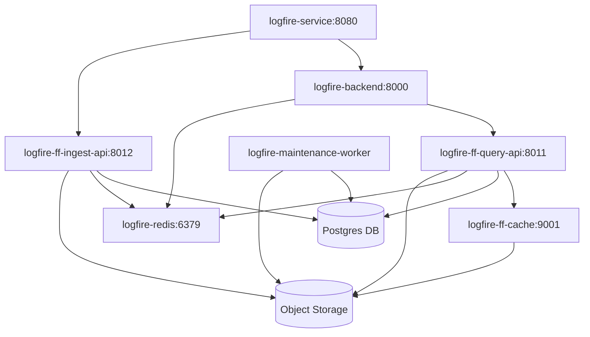

# Logfire Self-Hosted Service Architecture

The Self-hosted deployment has a number of interdependent services that work to run logfire.  Each component can be scaled independently of others depending on the utilisation of the system.

## Service Dependency Diagram

## Service Descriptions

### Entry Point
- `logfire-service` (Port 8080): Main entry point for the system

### Core Services
- `logfire-backend` (Port 8000): Backend service handling business logic, frontend and authentication
- `logfire-ff-ingest-api` (Port 8012): API for data ingestion
- `logfire-ff-query-api` (Port 8011): API for querying data
- `logfire-ff-maintenance-worker`:  Compaction and Maintenance Jobs
- `logfire-redis`: Live query streaming and autocomplete cache
- `logfire-ff-cache` (Port 9001 via `logfire-ff-conhash-cache` consistent hashing): Cache service
