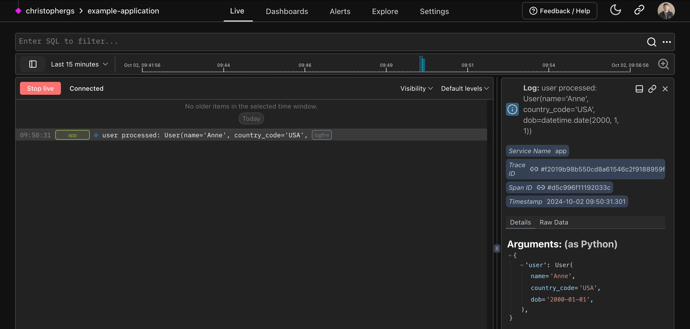

# Pydantic integration

Logfire has an out-of-the-box Pydantic integration that lets you understand the data passing through your Pydantic models and get analytics on validations. For existing Pydantic users, it delivers unparalleled insights into your usage of Pydantic models.

We can record Pydantic models directly:

```py
from datetime import date
import logfire
from pydantic import BaseModel

logfire.configure()

class User(BaseModel):
    name: str
    country_code: str
    dob: date

user = User(name='Anne', country_code='USA', dob='2000-01-01')
logfire.info('user processed: {user!r}', user=user)  # (1)!
```

1. This will show `user processed: User(name='Anne', country_code='US', dob=datetime.date(2000, 1, 1))`, but also allow you to see a "pretty" view of the model within the Logfire Platform.



Or we can record information about validations automatically:

```py
from datetime import date
import logfire
from pydantic import BaseModel

logfire.configure(pydantic_plugin=logfire.PydanticPlugin(record='all'))  # (1)!

class User(BaseModel):
    name: str
    country_code: str
    dob: date

User(name='Anne', country_code='USA', dob='2000-01-01')  # (2)!
User(name='Ben', country_code='USA', dob='2000-02-02')
User(name='Charlie', country_code='GBR', dob='1990-03-03')
```

1. This configuration means details about all Pydantic model validations will be recorded. You can also record details about validation failures only, or just metrics; see the [pydantic plugin docs][logfire.PydanticPlugin].
2. Since we've enabled the Pydantic Plugin, all Pydantic validations will be recorded in Logfire.

Learn more about the [Pydantic Plugin here](integrations/pydantic.md).


