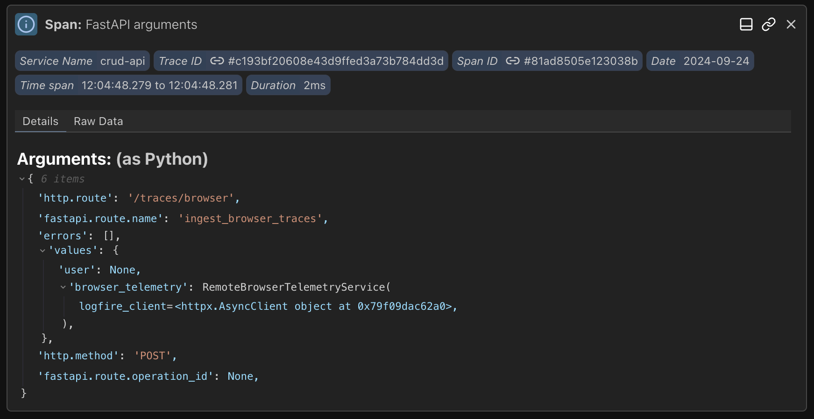

# Python-centric insights :material-snake:

Pydantic Logfire automatically instruments your code for minimal manual effort, provides exceptional insights into async code, offers detailed performance analytics, and displays Python objects the same as the interpreter. Pydantic Logfire  gives you a clearer view into how your Python is running than any other observability tool.

## Rich display of Python objects

## Profiling Python code

<!-- TODO: screengrab -->
