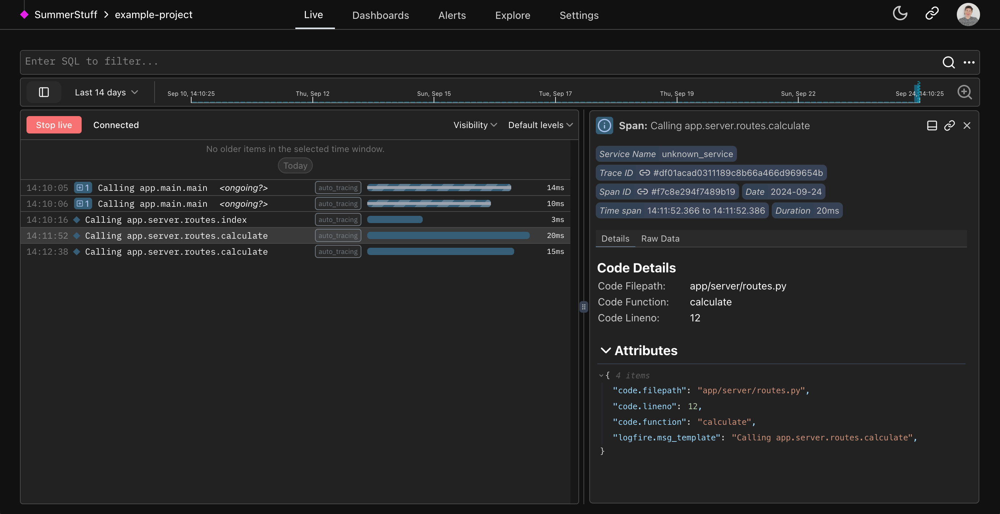

# Python-centric insights :material-snake:

Pydantic Logfire automatically instruments your code for minimal manual effort, provides exceptional insights into async code, offers detailed performance analytics, and displays Python objects the same as the interpreter. Pydantic Logfire gives you a clearer view into how your Python is running than any other observability tool.

## Rich display of Python objects

In this example, you can see the parameters passed to a FastAPI endpoint formatted as a Python object.

## Profiling Python code

In this simple app example, you can see every interaction the user makes with the web app automatically traced to the Live view using the [Auto-tracing method](../guides/onboarding-checklist/add-auto-tracing.md).
