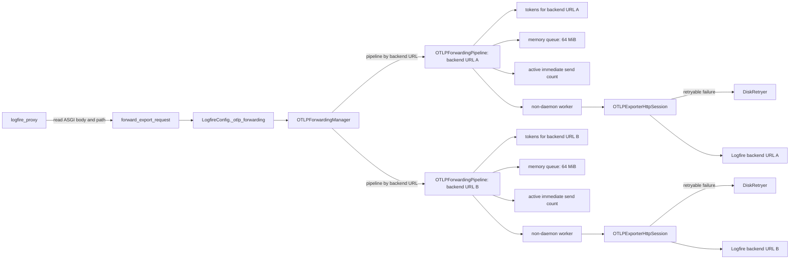
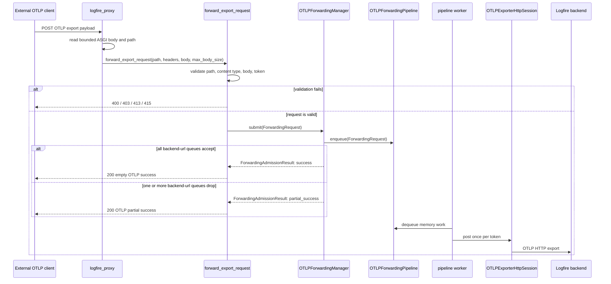
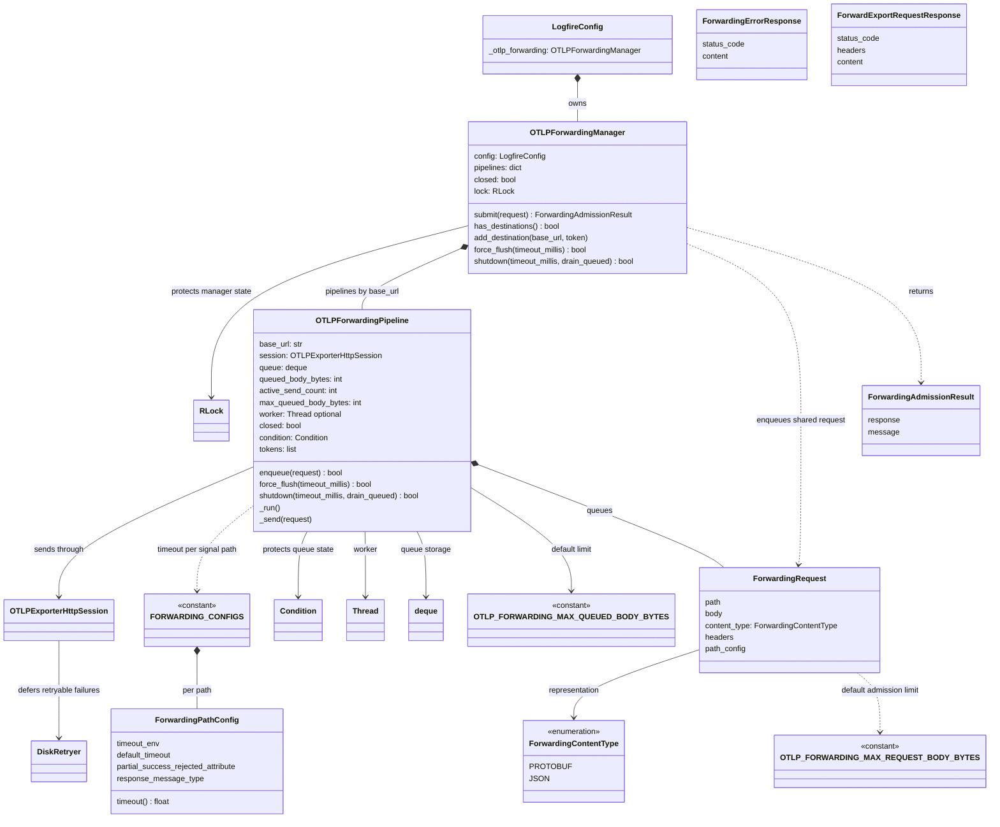
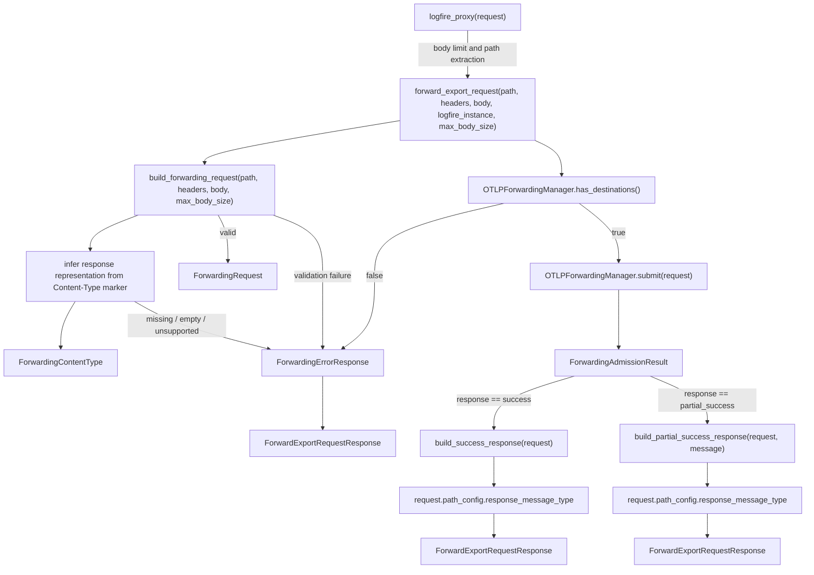
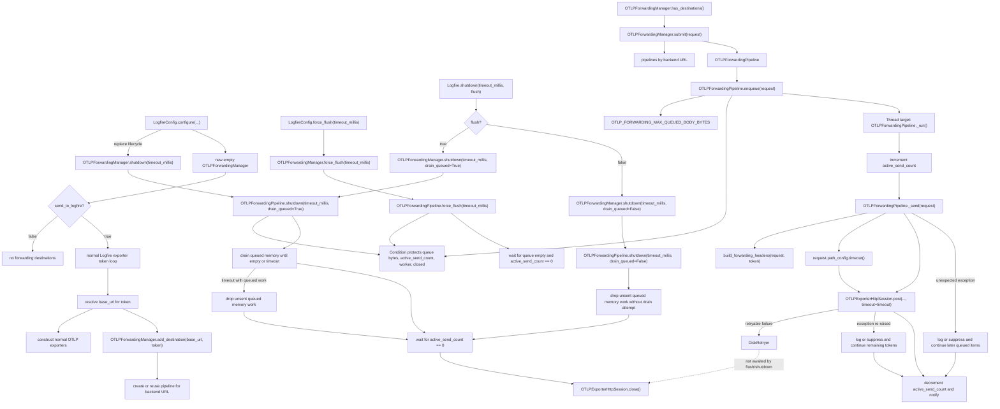

# OTLP Telemetry Forwarding First Pass Diagrams

**These diagrams support the code spec in [code-spec](code-spec.md), which implements the prose spec in [spec](spec.md).**

**Forwarding ownership is config-scoped and backend-url separated.** *(supports "Forwarding transport lifecycle is owned by Logfire configuration, not by each forwarding call", "Destination pipelines are separated by resolved backend URL")*
This diagram shows ownership and isolation boundaries. Public helpers submit to the config-owned manager; the manager separates work by resolved backend URL; each backend-url pipeline owns its memory queue, worker, session, and disk retry state.

**Request admission returns before Logfire delivery.** *(supports "Accepted OTLP payloads are queued locally before any Logfire network I/O", "Accepted queued payloads return local OTLP success", "Locally dropped valid payloads return OTLP partial success")*
This sequence shows the response boundary. Validation failures return local error responses. Valid requests are submitted to the manager, and the client response reflects local admission only. Background workers perform Logfire sends after the app request path has returned.

**Forwarding data types are small and owned by one layer.** *(supports "Forwarding transport lifecycle is owned by Logfire configuration, not by each forwarding call", "Destination pipelines are separated by resolved backend URL")*
This type graph covers the data structures and stateful owners used by the forwarding path. External synchronization/transport types are included where they appear as fields because they define lifecycle responsibilities.

**Admission functions convert inbound HTTP into a local response.** *(supports "The forwarding endpoint is an ingress adapter, not a transparent HTTP proxy", "Response encoding matches the inferred request representation")*
This call graph covers the public helpers, validation helpers, response builders, and response/result data types. It shows where `ForwardingErrorResponse` stops the path before queue admission and where `ForwardExportRequestResponse` is produced for the caller.

**Manager and pipeline methods own lifecycle, flushing, and sending.** *(supports "Forwarding participates in Logfire flush and shutdown", "The forwarding worker is non-daemon and lifecycle-managed", "Forwarding sends use the existing OTLP session retry ownership")*
This lifecycle graph covers each manager and pipeline method. It also shows how config-level lifecycle calls interact with the forwarding manager and how the worker uses the existing OTLP session retry behavior.

